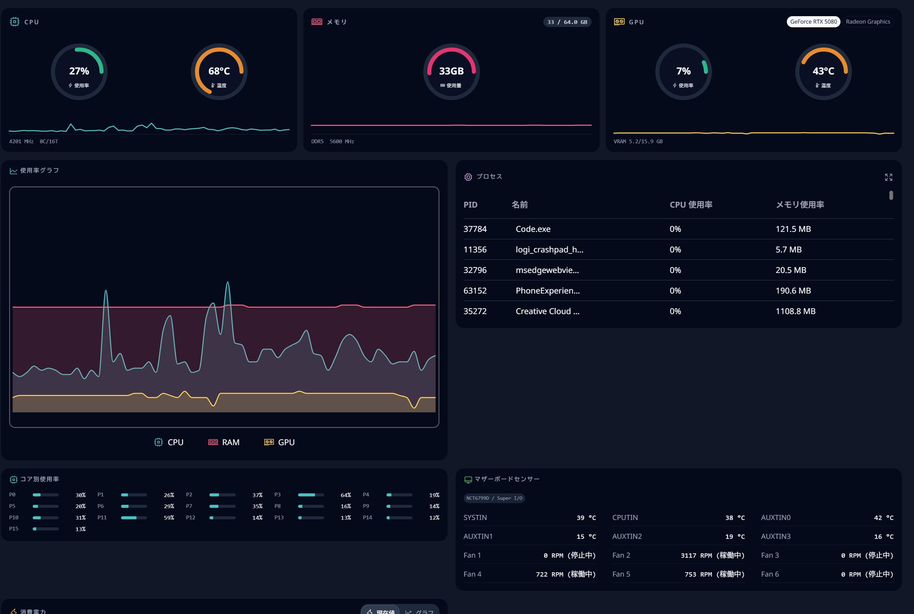
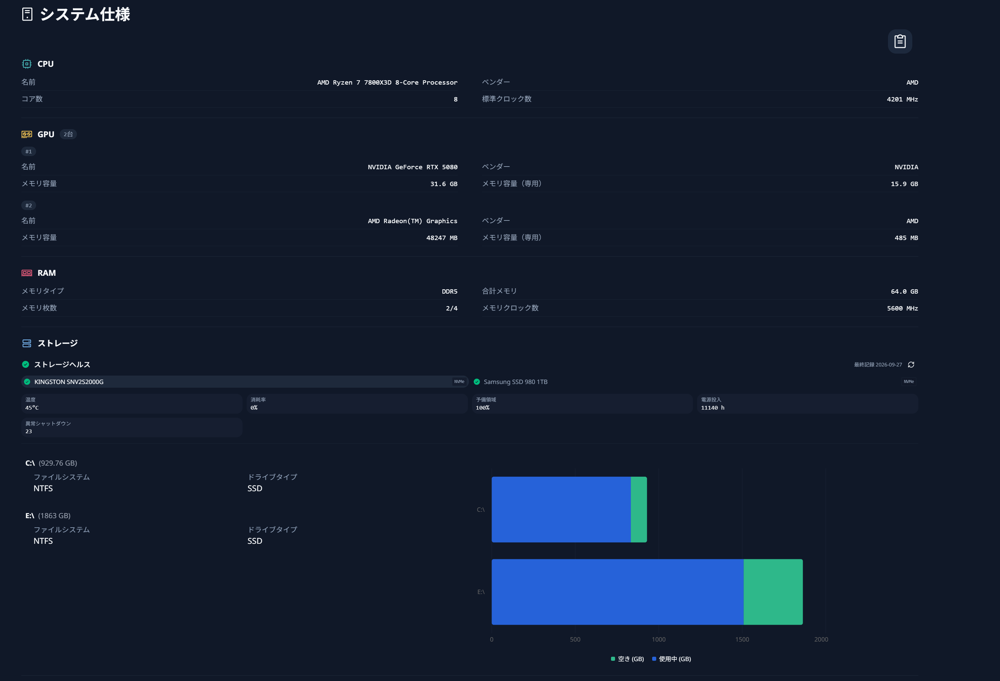
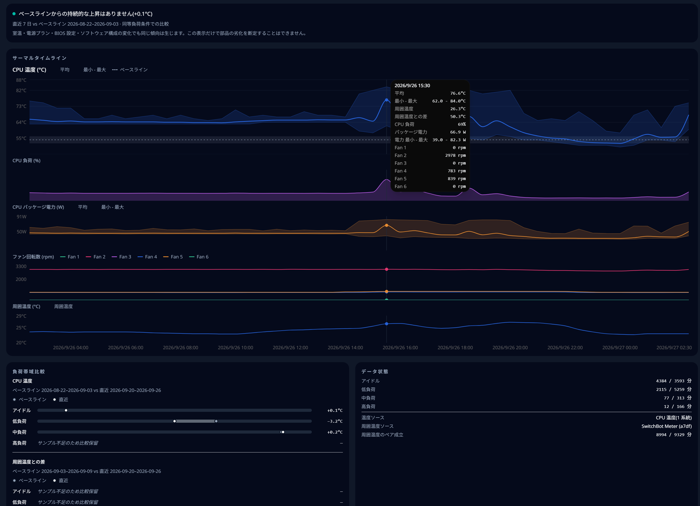

# HardwareVisualizer

[English](README.md) | [日本語](README.ja.md)

[](https://github.com/shm11C3/HardwareVisualizer/releases)
[](https://github.com/shm11C3/HardwareVisualizer/actions/workflows/ci.yml)


[](LICENSE)
[](https://app.fossa.com/projects/git%2Bgithub.com%2Fshm11C3%2FHardwareVisualizer?ref=badge_shield)
[](https://deepwiki.com/shm11C3/HardwareVisualizer)



HardwareVisualizer は、コンピュータのハードウェアをリアルタイムで監視し、数日から数か月にわたる動作を振り返るためのデスクトップアプリです。リアルタイムのパフォーマンス表示、システム仕様の一覧、そして PC 内に保存したハードウェア履歴にもとづくインサイトを備えています。

Web サイト: <https://hardviz.com/>

> [!NOTE]
>
> ## 公式ダウンロードとセキュリティに関する注意
>
> HardwareVisualizer は、以下のチャネルを通じて**のみ**公式に配布されています。
>
> - GitHub Releases: https://github.com/shm11C3/HardwareVisualizer/releases
> - 公式ウェブサイト: https://hardviz.com/
>
> その他の配布元（例：サードパーティのミラーサイトや SourceForge などのダウンロードサイトの掲載）は、本プロジェクトとは**一切関係ありません**。
>
> 特に、SourceForge 上の `Hardware Visualizer` (`https://sourceforge.net/projects/hardware-visualizer/`) というプロジェクトは、開発者の関与なしに作成されたものです。そこで公開されている ZIP アーカイブの真正性や安全性については確認が取れていません。利用される場合は自己責任でお願いいたします。

## 目次

- [HardwareVisualizer](#hardwarevisualizer)
  - [目次](#目次)
  - [インストールガイド](#インストールガイド)
    - [ダウンロード](#ダウンロード)
    - [Windows へのインストール](#windows-へのインストール)
      - [インストーラを使用する](#インストーラを使用する)
      - [Winget コマンドを使用する](#winget-コマンドを使用する)
    - [macOS へのインストール](#macos-へのインストール)
    - [Linux へのインストール](#linux-へのインストール)
    - [初期設定](#初期設定)
  - [機能一覧](#機能一覧)
    - [プラットフォーム別の対応状況](#プラットフォーム別の対応状況)
  - [サポート OS](#サポート-os)
  - [スクリーンショット](#スクリーンショット)
    - [システム仕様](#システム仕様)
    - [Cooling Insight](#cooling-insight)
    - [背景画像](#背景画像)
  - [権限とセキュリティについて](#権限とセキュリティについて)
  - [ロードマップ](#ロードマップ)
  - [フィードバックと Discussion](#フィードバックと-discussion)
  - [コントリビューション](#コントリビューション)
  - [コード署名ポリシー（英語版のみ）](#コード署名ポリシー英語版のみ)
  - [Special Thanks](#special-thanks)
  - [ライセンス](#ライセンス)

## インストールガイド

### ダウンロード

お使いのプラットフォームに合わせて、最新のインストーラーをダウンロードしてください。

- **公式ウェブサイト**: [hardviz.com/#download](https://hardviz.com/#download)
- **GitHub Releases**: [最新リリース](https://github.com/shm11C3/HardwareVisualizer/releases/latest) > Assets セクション

チェックサムと provenance の確認方法は、
[ダウンロード検証ガイド](docs/download-verification.ja.md) を参照してください。

### Windows へのインストール

#### インストーラを使用する

1. ダウンロードページから `HardwareVisualizer_x.x.x_x64_en-US.msi`（推奨）または `HardwareVisualizer_x.x.x_x64-setup.exe` をダウンロードします。
2. インストーラー（`.msi` または `.exe` ファイル）を実行します。
3. インストールウィザードの指示に従います。
4. スタートメニューまたはデスクトップのショートカットから **HardwareVisualizer** を起動します。

`.msi` インストーラーの利用を推奨します。`.msi` は HardwareVisualizer を Program Files 配下にインストールします。**管理者として起動** を使うには、Program Files 配下へのインストールが必要です。

`.msi` インストーラーでは、CPU 温度・消費電力とマザーボードのセンサーを取得できるようにする [PawnIO](https://pawnio.eu/) のセットアップを選択できます。この項目は既定で選択されており、選択を外すこともできます。選択した場合、インストーラーは固定されたバージョンの PawnIO をダウンロードして検証し、不足しているものだけをインストールします。この項目は、HardwareVisualizer を Program Files 配下（既定のインストール先）にインストールする場合に選択できます。HardwareVisualizer をアンインストールしても PawnIO は削除されません。`.exe` インストーラーを使う場合や後からセットアップする場合は、**設定 → 高度な設定** から実行してください。

MSI のサイレントインストールでは、明示的に指定した場合のみ PawnIO をセットアップします。

```powershell
msiexec /i HardwareVisualizer_x.x.x_x64_en-US.msi /qn EXTERNAL_COMPONENT_PAWNIO=1
```

#### Winget コマンドを使用する

Windows の場合、Windows Package Manager（Winget）を使用してインストールすることもできます。
PowerShell またはコマンドプロンプトで以下のコマンドを実行してください。

```powershell
winget install shm11C3.HardwareVisualizer
```

Winget でのインストールでは PawnIO はセットアップされません。インストール後に **設定 → 高度な設定** から実行してください。

> [!NOTE]
> 基本的な監視には管理者権限は必要ありません。PawnIO 経由で取得するセンサー
> （CPU 温度・消費電力、マザーボードの温度とファン）には管理者権限が必要です。
> 利用するには **設定 → 高度な設定 → 管理者として起動** を有効にしてください。

### macOS へのインストール

1. ダウンロードページから `HardwareVisualizer_x.x.x_aarch64.dmg`（Apple Silicon）または `HardwareVisualizer_x.x.x_x64.dmg`（Intel）をダウンロードします。
2. `.dmg` ファイルを開き、**HardwareVisualizer** をアプリケーションフォルダへドラッグします。
3. アプリケーションフォルダまたは Launchpad から **HardwareVisualizer** を起動します。

### Linux へのインストール

1. ダウンロードページから、以下のいずれかのパッケージをダウンロードします。
   - Debian / Ubuntu: `HardwareVisualizer_x.x.x_amd64.deb`
   - Fedora / RHEL: `HardwareVisualizer-x.x.x-1.x86_64.rpm`
   - その他のディストリビューション: `HardwareVisualizer_x.x.x_amd64.AppImage`
2. パッケージをインストールします。

   ```bash
   sudo apt install ./HardwareVisualizer_*.deb   # Debian / Ubuntu
   sudo dnf install ./HardwareVisualizer-*.rpm   # Fedora / RHEL
   ```

   AppImage を使う場合は、実行権限を付けて直接起動します。

   ```bash
   chmod +x HardwareVisualizer_*.AppImage
   ./HardwareVisualizer_*.AppImage
   ```

3. アプリケーションメニューまたはターミナルから起動します。

   ```bash
   hardware-visualizer
   ```

> [!TIP]
>
> ### ハードウェアデータが表示されない場合
>
> - メモリの詳細情報を取得するときは、polkit（`pkexec dmidecode`）による認証を求められます。
> - ストレージの健康状態は `smartctl`（smartmontools）、Intel GPU の使用率は
>   `intel_gpu_top` を使って取得します。どちらも通常は root 権限が必要です。
>   取得するには sudo で再起動してください。
>
>   ```bash
>   sudo hardware-visualizer
>   ```
>
> - CPU 温度、消費電力、マザーボードのセンサーは、Linux ではまだ取得できません。

### 初期設定

アプリ起動後の手順：

1. **設定**（サイドバーの ⚙️ アイコン）へ移動します。
2. お好みの**テーマ**と**言語**を選択します。
3. （任意）カスタムの**背景画像**を設定します。
4. （任意、Windows）**設定 → 高度な設定** から PawnIO をセットアップすると、CPU 温度・消費電力とマザーボードのセンサーを取得できます。

## 機能一覧

- **パフォーマンス**: CPU、メモリ、GPU のゲージと使用率グラフ、コアごとの使用率、実行中のプロセス、マザーボードのセンサーとファン、消費電力をリアルタイムで表示します。パネル・コンパクト・モニターの各表示を切り替えられ、パネルの表示や並び順も変更できます。複数の GPU を搭載している場合は、表示する GPU を選択できます。
- **システム仕様**: CPU、GPU、メモリ、ストレージ、プラットフォーム、マザーボード / BIOS、ネットワークの情報を一覧表示し、ハードウェアレポートとしてコピーできます。ストレージの健康状態では、ドライブごとに SMART の状態、温度、摩耗度などを確認できます。
- **インサイト**: CPU・メモリ使用率と CPU 温度、GPU ごとの使用率・温度・メモリ使用量について、平均・最大・最小の履歴を最大 30 日間表示します。プロセスの履歴とスナップショットでは、CPU とメモリを使っていたプロセスを確認できます。
- **Cooling Insight**（インサイトの「冷却」タブ）: 似た負荷のときの CPU 温度を、その PC 自身のベースラインと最大 1 年間比較します。CPU 温度、負荷、パッケージ電力、ファン回転数、室温を 1 つのタイムラインで表示するため、冷却性能が落ちているのか、室温が上がっただけなのかを見分けられます。
- **室温の取得**（Windows）: 近くにある SwitchBot 温湿度計から Bluetooth で室温を読み取ります。SwitchBot アカウント、インターネット接続、ペアリングはいずれも不要です。
- **トレイウィジェット**: CPU 使用率、GPU 使用率、GPU 温度をシステムトレイまたはメニューバーに表示します。ウィンドウを閉じてもトレイで動作を続けることもできます。
- **カスタマイズ**: カラーテーマ、透過 UI、グラフのスタイルと色、ウィンドウに合わせたグラフサイズ、ローカル画像による背景、℃ / ℉ の切り替えに対応しています。
- **ローカルの履歴**: ハードウェアの履歴は既定で 365 日間保存され、**設定 → インサイト** で変更できます。v1.11.0 より前に作成したプロファイルは、同じ画面で変換するまで以前のデータベースを使い続けます。
- **言語**: 英語、日本語、ロシア語

### プラットフォーム別の対応状況

| 機能                               | Windows                                | Linux                | macOS                                         |
| ---------------------------------- | -------------------------------------- | -------------------- | --------------------------------------------- |
| CPU / メモリ使用率、プロセス       | ✅                                     | ✅                   | ✅                                            |
| GPU 使用率                         | ✅ NVIDIA、AMD、その他は PDH 経由      | ✅ AMD、Intel ¹      | ✅                                            |
| GPU 温度                           | ✅ NVIDIA、AMD                         | ✅ AMD               | —                                             |
| CPU 温度                           | ✅ PawnIO ² または ACPI サーマルゾーン | —                    | —                                             |
| 消費電力                           | ✅ CPU パッケージ ²                    | —                    | ✅ CPU、GPU、ANE、パッケージ（Apple Silicon） |
| マザーボードの温度とファン         | ✅ 対応する Super I/O チップ ²         | —                    | —                                             |
| ストレージの健康状態（SMART）      | ✅                                     | ✅ `smartctl` 経由 ³ | ✅ `smartctl` 経由 ³                          |
| ネットワークインターフェースの情報 | ✅                                     | ✅                   | ✅                                            |
| 室温（SwitchBot）                  | ✅                                     | —                    | —                                             |
| Cooling Insight                    | ✅ ⁴                                   | —                    | —                                             |
| トレイウィジェット                 | ✅ フライアウト                        | ✅ トレイのタイトル  | ✅ メニューバー                               |

1. Linux では NVIDIA GPU は一覧に表示されますが、値はまだ取得できません。Intel GPU の使用率の取得には `intel_gpu_top` が必要です。
2. PawnIO と管理者権限が必要です。マザーボードのセンサーは Nuvoton NCT6799D に対応しています。NCT6796D と ITE IT8728F（温度のみ）は実験的な対応です。
3. smartmontools が必要です。
4. CPU 温度が必要です。電力、ファン、室温の各レーンは、対応するセンサーがある場合に表示されます。

## サポート OS

| OS      | ステータス  | アーキテクチャ              | ダウンロード                                  |
| ------- | ----------- | --------------------------- | --------------------------------------------- |
| Windows | ✅ 対応済み | x64（Windows 10 / 11）      | [ダウンロード](https://hardviz.com/#download) |
| Linux   | ✅ 対応済み | x86_64                      | [ダウンロード](https://hardviz.com/#download) |
| macOS   | ✅ 対応済み | Apple Silicon、Intel（x64） | [ダウンロード](https://hardviz.com/#download) |

## スクリーンショット

パフォーマンス画面は、このページの冒頭に掲載しています。

### システム仕様

ストレージごとの健康状態を含め、ハードウェアの情報を一目で確認できます。



### Cooling Insight

似た負荷のときの CPU 温度がベースラインより上がっていないかを確認できます。CPU 負荷、パッケージ電力、ファン回転数、室温も同じタイムラインに表示します。



### 背景画像


## 権限とセキュリティについて

| 項目                           | 理由                                                                  |
| ------------------------------ | --------------------------------------------------------------------- |
| Windows の WMI                 | メモリ・システム・ストレージの詳細情報、サーマルゾーンの取得          |
| Windows の PDH                 | GPU エンジン使用率                                                    |
| Windows の管理者権限（PawnIO） | CPU 温度・消費電力、マザーボードの温度とファン                        |
| Windows の Bluetooth           | SwitchBot 温湿度計の読み取り（設定で有効にした場合のみ）              |
| Linux の polkit（`pkexec`）    | `dmidecode` によるメモリの詳細情報                                    |
| Linux の sudo 権限             | ストレージの健康状態の `smartctl`、Intel GPU 使用率の `intel_gpu_top` |

HardwareVisualizer にテレメトリはなく、ハードウェアのデータは PC の外へ送信されません。アプリがインターネットに接続するのは、GitHub Releases で更新を確認するときと、ユーザーがセットアップを選んだ場合に PawnIO を公式の GitHub リリースからダウンロードするときだけです。

## ロードマップ

| 項目                                                       | ステータス |
| ---------------------------------------------------------- | ---------- |
| macOS への対応                                             | ✅ 完了    |
| AMD GPU への対応                                           | ✅ 完了    |
| ファン監視（Windows、対応する Super I/O チップ）           | ✅ 完了    |
| 消費電力の表示（Windows の CPU パッケージ、Apple Silicon） | ✅ 完了    |
| 全ベンダー共通のファン・温度制御                           | 調査中     |
| ゲームモード                                               | 計画中     |
| 消費電力の推定機能                                         | 検討中     |
| プラグインシステム                                         | 検討中     |

## フィードバックと Discussion

質問、まだ曖昧なアイデア、実装方針が決まっていない要望は、Issue を作成する前に
[GitHub Discussions](https://github.com/shm11C3/HardwareVisualizer/discussions)
へ投稿してください。

- [UI フィードバック](https://github.com/shm11C3/HardwareVisualizer/discussions/1699):
  読みやすさ、画面遷移、ダッシュボードのレイアウト、グラフ、設定、トレイ /
  ウィジェット、見た目のカスタマイズについて。
- [機能アイデア](https://github.com/shm11C3/HardwareVisualizer/discussions/1700):
  新しいワークフロー、ハードウェア対応、アラート、履歴、カスタマイズ、エクスポート、
  その他の改善案について。
- [匿名アンケート](https://hardviz.com/survey/?source=web):
  GitHub に公開投稿したくない場合はこちらから送信できます。

再現手順のある不具合や、実装内容が具体的な要望は
[CONTRIBUTING.md](CONTRIBUTING.md) のテンプレートから Issue を作成してください。

## コントリビューション

詳細は [CONTRIBUTING.md](CONTRIBUTING.md) をご覧ください。

## コード署名ポリシー（英語版のみ）

署名状況の詳細は [CODE_SIGNING_POLICY.md](CODE_SIGNING_POLICY.md) をご覧ください。
チェックサムと provenance の確認方法は [ダウンロード検証ガイド](docs/download-verification.ja.md) を参照してください。

## Special Thanks

HardwareVisualizer は、多くのオープンソースプロジェクト、ツール、コントリビューターの成果に支えられています。

- [Tauri](https://tauri.app/) — 軽量なクロスプラットフォームデスクトップアプリケーションの基盤を提供しているプロジェクトです。
- [sysinfo](https://github.com/GuillaumeGomez/sysinfo) — クロスプラットフォームなシステム情報取得を支えているプロジェクトです。
- [nvapi-rs](https://github.com/arcnmx/nvapi-rs) — Rust から NVIDIA NVAPI を扱うために利用しているプロジェクトです。
- [macmon](https://github.com/vladkens/macmon) — MITライセンスで公開されている macOS 向けモニタリング実装であり、HardwareVisualizer の macOS センサー対応の参考にしています。
- [PawnIO](https://pawnio.eu/) / [PawnIO.Modules](https://github.com/namazso/PawnIO.Modules) — Windows向けの任意ネイティブCPU温度取得において、利用可能な場合に連携できる低レベルインターフェースを提供しているプロジェクトです。

注: この謝辞は、記載されたすべてのプロジェクトがHardwareVisualizerに同梱されている、またはすべての環境で使用されていることを意味するものではありません。Windows向けPawnIO CPU温度実装は、第三者の監視ツール実装を移植したものではなく、このリポジトリ内のclean-room sensor specificationsに基づいて実装されています。

## ライセンス

HardwareVisualizer は [GNU General Public License v3.0 or later](LICENSE)（GPL-3.0-or-later）で提供されています。

- ライセンス変更前にリリースされたバージョン（v1.10.1 以前および `1.10.x` メンテナンスライン）は、引き続き [MIT License](docs/licenses/MIT-pre-relicense.txt) で利用できます。
- ライセンス変更前に MIT License で受け入れたコードは、この GPL ライセンスの成果物の一部として MIT License のままです。その表記は [docs/licenses/MIT-pre-relicense.txt](docs/licenses/MIT-pre-relicense.txt) に保持され、アプリケーションに同梱されます。
- サードパーティコンポーネントはそれぞれのライセンスに従います。同梱の `THIRD_PARTY_NOTICES.md`（アプリの 設定 → ライセンス）を参照してください。

決定内容と適用開始リビジョンは [ADR 0020](docs/adr/0020-relicense-to-gpl-3.0-or-later.md) に記録しています。
