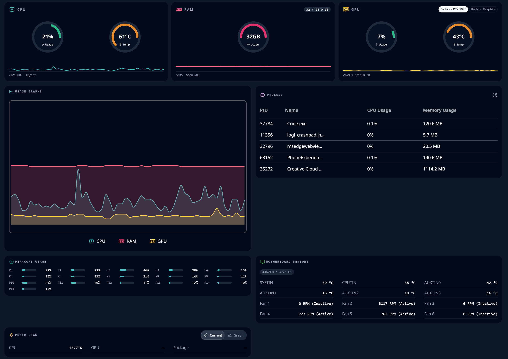
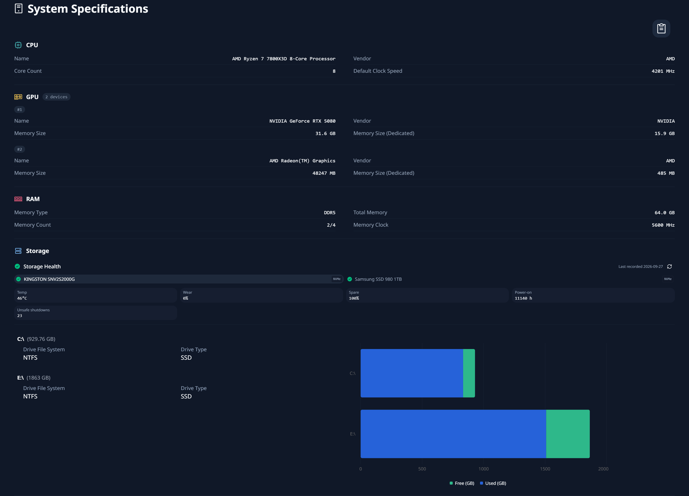
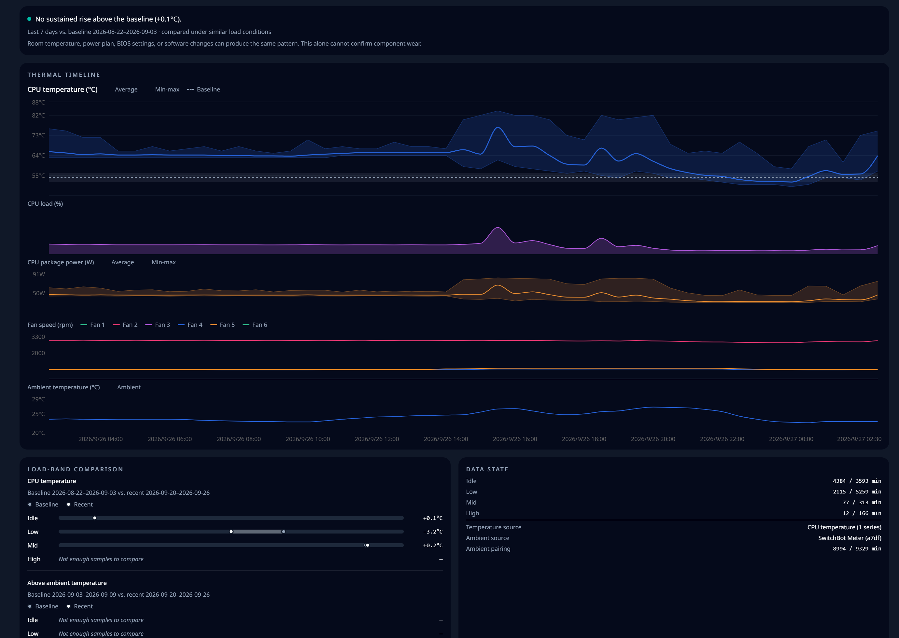

# HardwareVisualizer

[English](README.md) | [日本語](README.ja.md)

[](https://github.com/shm11C3/HardwareVisualizer/releases)
[](https://github.com/shm11C3/HardwareVisualizer/actions/workflows/ci.yml)


[](LICENSE)
[](https://app.fossa.com/projects/git%2Bgithub.com%2Fshm11C3%2FHardwareVisualizer?ref=badge_shield)
[](https://scorecard.dev/viewer/?uri=github.com/shm11C3/HardwareVisualizer)
[](https://deepwiki.com/shm11C3/HardwareVisualizer)



HardwareVisualizer is a desktop app for monitoring your computer's hardware in real time and looking back at how it behaved over days and months. It combines live performance views, a system specifications sheet, and Insights built from a hardware history that stays on your computer.

Web: <https://hardviz.com/>

> [!NOTE]
>
> ## Official downloads & security notice
>
> HardwareVisualizer is officially distributed **only** through the channels below:
>
> - GitHub Releases: https://github.com/shm11C3/HardwareVisualizer/releases
> - Official website: https://hardviz.com/
>
> Any other distribution (e.g. third-party mirrors or listings on download sites such as
> SourceForge) is **not affiliated** with this project.
>
> In particular, the SourceForge project named `Hardware Visualizer`
> (`https://sourceforge.net/projects/hardware-visualizer/`) was created without my
> involvement. I cannot verify the authenticity or safety of the ZIP archives
> published there. Use them at your own risk.

## Table of Contents

- [HardwareVisualizer](#hardwarevisualizer)
  - [Table of Contents](#table-of-contents)
  - [Installation Guide](#installation-guide)
    - [Download](#download)
    - [Windows Installation](#windows-installation)
      - [Using the Installer](#using-the-installer)
      - [Using Winget](#using-winget)
    - [macOS Installation](#macos-installation)
    - [Linux Installation](#linux-installation)
    - [First-time Setup](#first-time-setup)
  - [Features](#features)
    - [Platform Support](#platform-support)
  - [Supported OS](#supported-os)
  - [Screenshots](#screenshots)
    - [System Specifications](#system-specifications)
    - [Cooling Insight](#cooling-insight)
    - [Background Image](#background-image)
  - [Permissions \& Security Notes](#permissions--security-notes)
  - [Roadmap](#roadmap)
  - [Feedback and Discussions](#feedback-and-discussions)
  - [Contributing](#contributing)
  - [Code Signing Policy](#code-signing-policy)
  - [Special Thanks](#special-thanks)
  - [License](#license)

## Installation Guide

### Download

Choose your platform and download the latest installer:

- **Official Website**: [hardviz.com/#download](https://hardviz.com/#download)
- **GitHub Releases**: [Latest Release](https://github.com/shm11C3/HardwareVisualizer/releases/latest) > Assets section

For checksum and provenance checks, see the
[download verification guide](docs/download-verification.md).

### Windows Installation

#### Using the Installer

1. Download `HardwareVisualizer_x.x.x_x64_en-US.msi` (recommended) or `HardwareVisualizer_x.x.x_x64-setup.exe` from the download page
2. Run the installer (`.msi` or `.exe` file)
3. Follow the installation wizard
4. Launch **HardwareVisualizer** from Start Menu or Desktop shortcut

The `.msi` installer is recommended. It installs HardwareVisualizer under Program Files, which **Run as administrator on startup** requires.

The `.msi` installer offers to set up [PawnIO](https://pawnio.eu/), which enables CPU temperature and power and motherboard sensors. The option is selected by default and you can deselect it. When selected, the installer downloads the pinned PawnIO release, verifies it, and installs only what is missing. The option is available when HardwareVisualizer is installed under Program Files (the default location). PawnIO is not removed when you uninstall HardwareVisualizer. With the `.exe` installer, or at any later time, set it up from **Settings → Advanced**.

Silent MSI installs do not set up PawnIO unless you opt in:

```powershell
msiexec /i HardwareVisualizer_x.x.x_x64_en-US.msi /qn EXTERNAL_COMPONENT_PAWNIO=1
```

#### Using Winget

You can also install using Windows Package Manager (Winget).
Run the following command in PowerShell or Command Prompt:

```powershell
winget install shm11C3.HardwareVisualizer
```

Winget installs do not set up PawnIO; use **Settings → Advanced** after installation.

> [!NOTE]
> Basic monitoring does not require administrator rights. Sensors read through
> PawnIO (CPU temperature and power, motherboard temperatures and fans) need
> administrator access. Turn on **Settings → Advanced → Run as administrator on
> startup** to use them.

### macOS Installation

1. Download `HardwareVisualizer_x.x.x_aarch64.dmg` (Apple Silicon) or `HardwareVisualizer_x.x.x_x64.dmg` (Intel) from the download page
2. Open the `.dmg` file and drag **HardwareVisualizer** to the Applications folder
3. Launch **HardwareVisualizer** from Applications or Launchpad

### Linux Installation

1. Download one of the following packages from the download page:
   - Debian / Ubuntu: `HardwareVisualizer_x.x.x_amd64.deb`
   - Fedora / RHEL: `HardwareVisualizer-x.x.x-1.x86_64.rpm`
   - Other distributions: `HardwareVisualizer_x.x.x_amd64.AppImage`
2. Install the package:

   ```bash
   sudo apt install ./HardwareVisualizer_*.deb   # Debian / Ubuntu
   sudo dnf install ./HardwareVisualizer-*.rpm   # Fedora / RHEL
   ```

   To use the AppImage, make it executable and run it directly:

   ```bash
   chmod +x HardwareVisualizer_*.AppImage
   ./HardwareVisualizer_*.AppImage
   ```

3. Launch from application menu or terminal:

   ```bash
   hardware-visualizer
   ```

> [!TIP]
>
> ### Missing hardware data?
>
> - Detailed memory information asks for authorization through polkit
>   (`pkexec dmidecode`).
> - Storage Health uses `smartctl` (smartmontools), and Intel GPU usage uses
>   `intel_gpu_top`. Both usually need root access. Restart with sudo to let
>   them run:
>
>   ```bash
>   sudo hardware-visualizer
>   ```
>
> - CPU temperature, power draw, and motherboard sensors are not available on
>   Linux yet.

### First-time Setup

After launching the app:

1. Navigate to **Settings** (⚙️ icon in sidebar)
2. Choose your preferred **theme** and **language**
3. (Optional) Set a custom **background image**
4. (Optional, Windows) Set up PawnIO in **Settings → Advanced** to enable CPU temperature and power and motherboard sensors

## Features

- **Performance**: Live CPU, memory, and GPU gauges and usage graphs, per-core usage, running processes, motherboard sensors and fans, and power draw. Switch between the Panels, Compact, and Monitor views, and hide or reorder panels. Systems with several GPUs can choose which GPU to show.
- **System Specifications**: CPU, GPU, memory, storage, platform, motherboard / BIOS, and network details, with a hardware report you can copy. Storage Health shows SMART health, temperature, wear, and more for each drive.
- **Insights**: Average, maximum, and minimum history for CPU, memory, and CPU temperature, and for each GPU's usage, temperature, and memory, over up to 30 days. Process history and snapshots show which processes used CPU and memory.
- **Cooling Insight**: Compares CPU temperature with its own baseline under similar load, for up to 1 year. A single timeline shows CPU temperature, load, package power, fan speed, and ambient temperature, so you can see whether cooling is getting worse or only the room got warmer.
- **Ambient temperature** (Windows): Reads a nearby SwitchBot Meter over Bluetooth. No SwitchBot account, internet connection, or pairing is needed.
- **Tray widget**: Shows CPU usage, GPU usage, and GPU temperature in the system tray or menu bar. The app can keep running in the tray when you close the window.
- **Customization**: Color themes, transparent UI, graph style and colors, fit-to-window graphs, local background images, and °C / °F.
- **Local history**: Hardware history is kept for 365 days by default and can be changed in **Settings → Insights**. Profiles created before v1.11.0 keep their previous database until you convert it there.
- **Languages**: English, Japanese, Russian

### Platform Support

| Feature                           | Windows                           | Linux               | macOS                                     |
| --------------------------------- | --------------------------------- | ------------------- | ----------------------------------------- |
| CPU / memory usage, processes     | ✅                                | ✅                  | ✅                                        |
| GPU usage                         | ✅ NVIDIA, AMD, others via PDH    | ✅ AMD, Intel ¹     | ✅                                        |
| GPU temperature                   | ✅ NVIDIA, AMD                    | ✅ AMD              | —                                         |
| CPU temperature                   | ✅ PawnIO ² or ACPI thermal zones | —                   | —                                         |
| Power draw                        | ✅ CPU package ²                  | —                   | ✅ CPU, GPU, ANE, package (Apple Silicon) |
| Motherboard temperatures and fans | ✅ Supported Super I/O chips ²    | —                   | —                                         |
| Storage Health (SMART)            | ✅                                | ✅ via `smartctl` ³ | ✅ via `smartctl` ³                       |
| Network interface details         | ✅                                | ✅                  | ✅                                        |
| Ambient temperature (SwitchBot)   | ✅                                | —                   | —                                         |
| Cooling Insight                   | ✅ ⁴                              | —                   | —                                         |
| Tray widget                       | ✅ Flyout                         | ✅ Tray title       | ✅ Menu bar                               |

1. NVIDIA GPUs are listed on Linux, but their readings are not available yet. Intel GPU usage requires `intel_gpu_top`.
2. Requires PawnIO and administrator access. Motherboard sensors support Nuvoton NCT6799D. NCT6796D and ITE IT8728F (temperatures only) are experimental.
3. Requires smartmontools.
4. Requires CPU temperature. Power, fan, and ambient lanes appear when those sensors are available.

## Supported OS

| OS      | Status | Architecture               | Download                                  |
| ------- | ------ | -------------------------- | ----------------------------------------- |
| Windows | ✅     | x64 (Windows 10 / 11)      | [Download](https://hardviz.com/#download) |
| Linux   | ✅     | x86_64                     | [Download](https://hardviz.com/#download) |
| macOS   | ✅     | Apple Silicon, Intel (x64) | [Download](https://hardviz.com/#download) |

## Screenshots

The Performance view is shown at the top of this page.

### System Specifications

Hardware details at a glance, including Storage Health for each drive.



### Cooling Insight

Checks whether CPU temperature is rising above its own baseline under similar load, with CPU load, package power, fan speed, and ambient temperature on one timeline.



### Background Image


## Permissions & Security Notes

| Context                        | Reason                                                             |
| ------------------------------ | ------------------------------------------------------------------ |
| Windows WMI                    | Memory, system, and storage details, ACPI thermal zones            |
| Windows PDH                    | GPU engine utilization                                             |
| Windows administrator (PawnIO) | CPU temperature and power, motherboard temperatures and fans       |
| Windows Bluetooth              | SwitchBot Meter readings, only when turned on in Settings          |
| Linux polkit (`pkexec`)        | Detailed memory information through `dmidecode`                    |
| Linux sudo                     | `smartctl` for Storage Health, `intel_gpu_top` for Intel GPU usage |

HardwareVisualizer has no telemetry, and your hardware data stays on your computer. The app connects to the internet only to check GitHub Releases for updates and, when you choose to set it up, to download PawnIO from its official GitHub releases.

## Roadmap

| Item                                                | Target   |
| --------------------------------------------------- | -------- |
| macOS Support                                       | ✅ Done  |
| AMD GPU compatible                                  | ✅ Done  |
| Fan monitoring (Windows, supported Super I/O chips) | ✅ Done  |
| Power draw (Windows CPU package, Apple Silicon)     | ✅ Done  |
| Fan / Temp Full Cross Vendor                        | Research |
| Game Mode                                           | Planned  |
| Power Consumption Estimation                        | Idea     |
| Plugin System                                       | Idea     |

## Feedback and Discussions

Have a question, rough idea, or open-ended request? Please use
[GitHub Discussions](https://github.com/shm11C3/HardwareVisualizer/discussions)
before opening an implementation issue.

- [UI feedback](https://github.com/shm11C3/HardwareVisualizer/discussions/1699):
  readability, navigation, dashboard layout, charts, settings, tray/widget, and
  visual customization.
- [Feature ideas](https://github.com/shm11C3/HardwareVisualizer/discussions/1700):
  new workflows, hardware support, alerts, history, customization, export, or
  other improvement ideas.
- [Anonymous survey](https://hardviz.com/survey/?source=web): use this if you
  prefer not to post publicly on GitHub.

If you have a reproducible bug or a concrete implementation request, open an
Issue from the templates in [CONTRIBUTING.md](CONTRIBUTING.md).

## Contributing

See [CONTRIBUTING.md](CONTRIBUTING.md) for details.

Developer and maintainer documentation starts at
[docs/README.md](docs/README.md).

## Code Signing Policy

See [CODE_SIGNING_POLICY.md](CODE_SIGNING_POLICY.md) for signing status and the
[download verification guide](docs/download-verification.md) for checksum and
provenance checks.

## Special Thanks

HardwareVisualizer is made possible by many open-source projects, tools, and contributors.

- [Tauri](https://tauri.app/) — for providing the foundation for building lightweight cross-platform desktop applications.
- [sysinfo](https://github.com/GuillaumeGomez/sysinfo) — for cross-platform system information collection.
- [nvapi-rs](https://github.com/arcnmx/nvapi-rs) — for enabling access to NVIDIA's NVAPI from Rust.
- [macmon](https://github.com/vladkens/macmon) — for the MIT-licensed macOS monitoring implementation that informed parts of HardwareVisualizer's macOS sensor support.
- [PawnIO](https://pawnio.eu/) and [PawnIO.Modules](https://github.com/namazso/PawnIO.Modules) — for providing the low-level Windows interface that HardwareVisualizer can integrate with when available for optional native CPU temperature support.

Note: This acknowledgement does not mean that all listed projects are bundled with HardwareVisualizer or used in every build. The Windows PawnIO CPU temperature implementation is implemented from the repository's clean-room sensor specifications, not by porting third-party monitoring implementations.

## License

HardwareVisualizer is licensed under the [GNU General Public License v3.0 or later](LICENSE) (GPL-3.0-or-later).

- Versions released before the relicense, including v1.10.1 and the `1.10.x` maintenance line, remain available under the [MIT License](docs/licenses/MIT-pre-relicense.txt).
- Code contributed under the MIT License before the relicense keeps that license as part of this GPL-licensed work. Its notice is preserved in [docs/licenses/MIT-pre-relicense.txt](docs/licenses/MIT-pre-relicense.txt) and bundled with the application.
- Third-party components keep their own licenses. See the bundled `THIRD_PARTY_NOTICES.md` (Settings → License in the app).

The decision and its effective revision are recorded in [ADR 0020](docs/adr/0020-relicense-to-gpl-3.0-or-later.md).
