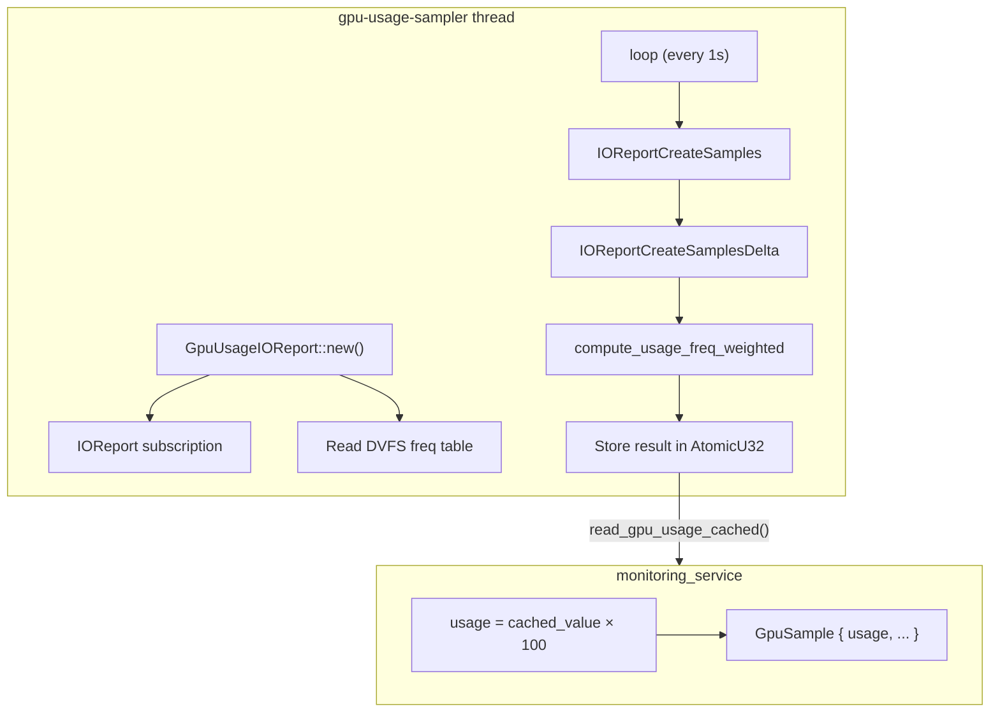

# macOS GPU Usage Algorithm

## Overview

On macOS (Apple Silicon), GPU usage is measured via Apple's private **IOReport** framework.
The reported value represents the fraction of the GPU's maximum computational capacity
currently in use, matching the metric shown by tools such as [macmon](https://github.com/vladkens/macmon).

## Data Sources

### 1. GPUPH Channel (IOReport)

IOReport exposes a channel under:

- **Group:** `GPU Stats`
- **Subgroup:** `GPU Performance States`
- **Channel:** `GPUPH`

This channel reports **residency** (time in nanoseconds) for each GPU power state:

| State        | Meaning                          |
| ------------ | -------------------------------- |
| `OFF`        | GPU is powered off (idle)        |
| `P1`         | Lowest active frequency          |
| `P2` – `P15` | Progressively higher frequencies |

A background thread samples this channel every 1 second via `IOReportCreateSamplesDelta`,
which yields per-state residency deltas for the interval.

### 2. GPU DVFS Frequency Table (IOKit Device Registry)

Each P-state corresponds to a specific clock frequency.
The mapping is read once at startup from the **PMGR** (Power Manager) IOKit node:

| Key | Value |
|-----|-------|
| IOKit service class | `AppleARMIODevice` |
| Registry entry name | `pmgr` |
| Property | `voltage-states9` |

`voltage-states9` is a packed binary blob of 8-byte records:

| Offset | Size | Field |
|--------|------|-------|
| 0 | 4 bytes | Frequency (little-endian, Hz) |
| 4 | 4 bytes | Voltage (little-endian) |

Frequencies are in Hz. Index 0 is the OFF state; indices 1–N map to P1–PN.

## Calculation

### Formula

```math
usage = (avg\_active\_freq \times active\_ratio) / max\_freq
```

Where:

- **active_ratio** = `Σ active_residency / Σ all_residency`
  - Active states: everything except OFF, IDLE, DOWN
- **avg_active_freq** = `Σ(residency_i × freq_i) / Σ active_residency`
  - Time-weighted average frequency across active P-states
- **max_freq** = highest frequency in the DVFS table (last entry)

### Why Frequency Weighting Matters

Without weighting, simple active-time ratio (`active_time / total_time`) significantly
overestimates GPU usage because:

- macOS keeps the GPU in **P1** (minimum frequency) for display compositing even when idle
- P1 occupies 40–60% of total time during normal desktop use
- Simple ratio reports this as 40–60% GPU usage

With frequency weighting, P1 time is scaled by `P1_freq / max_freq` (e.g., ~0.28 on M4),
producing a value that reflects actual computational load.

| Metric                                   | Idle Desktop | Light Workload |
| ---------------------------------------- | ------------ | -------------- |
| Simple active ratio                      | 40–60%       | 60–80%         |
| Frequency-weighted (this implementation) | 5–15%        | 15–30%         |

### Pseudocode

```text
residencies = IOReport_delta("GPUPH")
# → [(OFF, r0), (P1, r1), (P2, r2), ..., (P15, r15)]

dvfs_freqs = read_voltage_states9("pmgr")
# → [freq_off, freq_p1, freq_p2, ..., freq_p15]

active_freqs = dvfs_freqs[1:]   # skip OFF entry
offset = first index where state not in {OFF, IDLE, DOWN}

total     = sum(all residencies)
active    = sum(residencies[offset:])
avg_freq  = sum(residencies[i+offset] * active_freqs[i] for i in range(N)) / active
max_freq  = active_freqs[-1]

usage = clamp((max(avg_freq, min_freq) * active / total) / max_freq, 0.0, 1.0)
```

## Implementation Details

### Files

| File                                                  | Role                                                     |
| ----------------------------------------------------- | -------------------------------------------------------- |
| `infrastructure/providers/macos/io_kit/io_report.rs`  | IOReport subscription, sampling, and usage computation   |
| `infrastructure/providers/macos/io_kit/iokit_info.rs` | `read_gpu_dvfs_freqs_mhz()` — reads DVFS table from PMGR |
| `infrastructure/providers/macos/gpu.rs`               | Background sampler thread; caches result in `AtomicU32`  |
| `services/monitoring_service.rs`                      | Reads cached value and converts 0.0–1.0 → 0–100%         |

### Sampling Architecture



### Fallback

If the DVFS frequency table cannot be read (e.g., non-Apple-Silicon Mac or
missing PMGR node), the implementation falls back to simple active-time ratio.

## References

- [macmon](https://github.com/vladkens/macmon) (MIT) — Referenced for the
  frequency-weighted approach. No code copied; independently reimplemented.
- Apple IOReport framework (private API, no public documentation)
- Apple IOKit device registry
