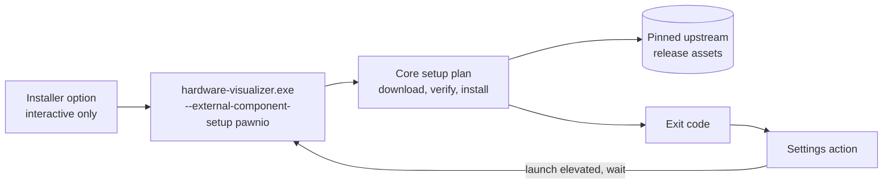

# External Component Setup Design

Status: implemented under
[ADR 0024](../adr/0024-external-component-setup.md).

This document records how HardwareVisualizer installs optional external
components on the user's request, which choices were evaluated, and which
decisions remain open. PawnIO on Windows is the first component. The shape is
component-neutral so a later component only adds a plan and copy, not a new
mechanism.

## Problem

PawnIO-backed CPU package temperature and power and Super I/O motherboard
sensors need three things that HardwareVisualizer's installer does not provide:
the PawnIO runtime (a signed kernel driver plus `PawnIOLib.dll`), the signed
module blobs from the separate PawnIO.Modules release, and administrator rights
to place both. External Component Guidance explains the manual steps, but the
steps are long enough that most users never complete them.

The maintainer's request is:

- offer the setup during installation as a per-component option that is
  selected by default and can be deselected;
- offer the same setup later from the Settings screen;
- never remove the component on uninstall, and only tell the user that it was
  kept, when the uninstaller can show anything.

## Upstream facts the design relies on

| Fact | Evidence |
| --- | --- |
| The runtime ships as `PawnIO_setup.exe` from the PawnIO.Setup GitHub release; the core install contains the runtime and tooling only, no sensor modules. | `docs/specs/sensors/pawnio-interface.md` (Installation and detection, Module blob distribution) |
| The installer elevates itself and supports an unattended mode with `-install -silent`. In silent mode it returns Windows error codes; `ERROR_SUCCESS_REBOOT_REQUIRED` (3010) means the driver install needs a restart. | winget manifest `namazso.PawnIO` 2.2.0 (`InstallerSwitches.Silent`, `ElevationRequirement: elevatesSelf`); PawnIO.Setup 2.2.0 release notes |
| Runtime 2.2.0 asset: `PawnIO_setup.exe`, 3,410,960 bytes, SHA-256 `1f519a22e47187f70a1379a48ca604981c4fcf694f4e65b734aaa74a9fba3032`. | Downloaded and hashed on 2026-09-13; matches the winget manifest digest |
| Modules ship as one zip per release containing signed `*.bin` files and the LGPL `COPYING`. Release 0.2.8: `release_0_2_8.zip`, 57,240 bytes, SHA-256 `def304df8691cd2d2b700068bcbe8454ad97064e6621c71420c128d368d83fb7`. | Downloaded and listed on 2026-09-13 |
| The sensor specification pins its IOCTL facts to PawnIO.Modules tag `0.2.8`. | `docs/specs/sensors/pawnio-interface.md`, source S5 |
| The installed runtime is discovered through `InstallLocation` under `HKLM\SOFTWARE\Microsoft\Windows\CurrentVersion\Uninstall\PawnIO` with `%ProgramFiles%\PawnIO` as the fallback. | Same spec; `core/src/infrastructure/providers/windows/pawn_io.rs` |
| The provider opens and caches the shared module handle once per process. | `open_shared_intel_msr` in `pawn_io.rs` uses a `OnceLock` |
| Tauri's MSI template uses `WixUI_InstallDir` and places fragment features under a hidden `External` feature; its NSIS template has no components page but exposes `NSIS_HOOK_PREINSTALL`, `POSTINSTALL`, `PREUNINSTALL`, and `POSTUNINSTALL` macros. | `crates/tauri-bundler/src/bundle/windows/msi/main.wxs` and `nsis/installer.nsi` at the pinned Tauri release |
| The MSI already downloads the WebView2 bootstrapper at install time when it is missing. | `src-tauri/tauri.conf.json` `webviewInstallMode: downloadBootstrapper` |

## Chosen approach

### Ownership

| Concern | Owner |
| --- | --- |
| Component catalog: pinned URLs, sizes, digests, module file list, installer switches, exit-code meaning | Core (`core/src/external_component_setup`) |
| Detection of the installed runtime and module files | Core, behind the platform trait |
| Download, digest verification, running the runtime installer, extracting module files | Core Windows platform implementation |
| Launching the current executable elevated and waiting for it | Core Windows platform implementation (generalizes the existing relaunch path) |
| Command-line dispatch of the setup mode and its exit code | App (`src-tauri/src/cli`) |
| Typed IPC, wire DTOs, Settings UI, restart prompt, copy | App and frontend |
| Installer dialogs, properties, custom actions (#2118), uninstall notice (#2119) | App bundle configuration (`src-tauri/windows/`, wired in `src-tauri/tauri.conf.json`) |

Nothing in this feature touches the clean-room sensor files. The setup module
reads the same registry value and module file names the provider documents,
but it does not read registers or share code with the provider.

### Setup plan for PawnIO

1. Resolve the runtime state from the uninstall registry key. A present key
   means installed and step 3 is skipped; `ERROR_FILE_NOT_FOUND` means
   absent; any other failure is unknown state and stops the run without
   changing anything.
2. Resolve the module state. The plan lists the module files the app can use:
   `IntelMSR.bin`, `RyzenSMU.bin`, `AMDFamily17.bin`, `LpcIO.bin`. A file is
   present when it exists under any known PawnIO root; a root that cannot be
   read is unknown state, not absence.
3. Create an administrator-only staging directory under `%SystemRoot%\Temp`
   (protected DACL, random name), download `PawnIO_setup.exe` into it, verify
   size and SHA-256, hold the file open with a share mode that denies write
   and delete while it runs with `-install -silent`, and map the exit code:
   `0` installed, `3010` installed with restart required, anything else
   failed.
4. When at least one module file is missing, download the pinned modules zip,
   verify it, and place only the missing files into the install location
   resolved from the registry (fallback `%ProgramFiles%\PawnIO`). Each file
   is written to a sibling partial file and linked into its final name; the
   link fails when the name already exists, so existing files are never
   replaced and a partial file never carries the final name.
5. Re-read the state. Report success only when the component is complete
   (or the installer asked for a restart), then exit with a code that encodes
   the outcome: `0` installed, `3010` restart required, `10`-`21` the stage
   that failed, `1` other. The caller derives the outcome from the exit code
   of the process handle it owns; no result file exists.

Every step is best-effort for the caller: a failed setup leaves the app
installed and its fallbacks unchanged.

### Entry points

- **Settings → Advanced → External components (implemented).** On Windows,
  each supported component shows its state (runtime installed, not installed,
  or unknown; which module files are present) and an action button that is
  disabled while the state is unknown. The action launches the executable
  elevated with the setup arguments, waits for exit, maps the exit code,
  refreshes the state, and shows the restart prompt on success. If the user
  declines the UAC prompt, the result is `cancelled` and nothing is shown as
  an error. One run per component is allowed at a time.

  *Unprotected install folders (#2216).* The action elevates `current_exe()`
  through `ShellExecuteExW` with `runas`, like "restart as administrator" and
  Elevated Startup Mode. When the executable's folder is writable without
  elevation (the NSIS per-user install, or an MSI installed outside Program
  Files), a same-user process could replace the executable before the prompt,
  and the UAC prompt would still look legitimate. Core therefore refuses
  every elevated launch unless the executable's resolved folder is under
  Program Files (`ElevationAvailability`, exposed to the UI as
  `get_elevation_availability`). A failure to resolve the folder also refuses.
  Elevated Startup Mode keeps its saved value and simply does not relaunch.
  Planting a DLL next to the executable is closed separately by linking with
  `/DEPENDENTLOADFLAG:0x800`, and #2215 recommends the MSI to NSIS users.

  *Elevated relaunch handoff (#2216 follow-up).* "Restart as administrator"
  and Elevated Startup Mode launch the elevated child before anything stops,
  so a declined UAC prompt or a failed launch returns an error while every
  worker keeps running, and the Settings toggle rolls back. The child is
  launched with `--wait-for-parent <pid>:<creation-time>` added to the
  current arguments, the parent's own process creation time making the id
  verifiable. Before its Tauri runtime starts, the child opens that process
  (`SYNCHRONIZE` and limited query), compares the creation time, and waits
  for it to exit with no timeout: the open handle keeps the id from being
  reused, and the parent still holds the single-instance lock and the
  database until it has drained its workers, so a child that ran ahead would
  exit as a second instance, leaving no app, or open the database beside the
  parent's live owner. An id that no process holds, or one held by a process
  with a different creation time, means the parent has already exited. If the
  parent cannot be opened or verified for any other reason, or the wait
  fails, the child prints the reason, says the app must be started again
  manually, and exits with code `3` instead of starting. Once the launch has
  succeeded, the parent stops its workers and exits as before. A plain
  restart (Settings, or Reset and Restart) passes the same handoff, since
  the restarted process has the same lock and database to wait for.

  *Over-the-shoulder elevation.* When a standard user answers the UAC prompt
  with another administrator's credentials, the elevated child runs as that
  account, and the parent's default DACL refuses it `SYNCHRONIZE`. The child
  then enables `SeDebugPrivilege`, which a full administrator token holds and
  which opens any process regardless of its DACL, retries the open once, and
  restores the privilege's previous state before waiting; the creation-time
  check still decides whether the opened process is the parent. If the retry
  still fails, the fail-closed exit above applies. That the child then runs
  with the other account's profile (settings, app data) predates the handoff.
- **MSI (implemented, #2118).** The WiX fragment
  `src-tauri/windows/wix/external-component-setup.wxs` adds an optional
  components dialog with one checkbox per component, inserted between
  `InstallDirDlg` and `VerifyReadyDlg` by publishing `NewDialog` events with a
  higher order than `WixUI_InstallDir` (the last `NewDialog` wins). The
  checkbox binds to the secure public property `EXTERNAL_COMPONENT_PAWNIO`.
  The property has no default in the `Property` table; a `SetProperty` in the
  UI sequence sets it to `1` on a fresh install, so only a full-UI install
  pre-selects it. `msiexec /qn`, `/passive` (the updater), and winget run no
  setup unless the caller passes `EXTERNAL_COMPONENT_PAWNIO=1`. A deferred,
  non-impersonated custom action after `InstallFiles` runs
  `[#Path] --external-component-setup pawnio` as LocalSystem inside the
  already elevated install, so there is no second prompt; `Return="ignore"`
  keeps a setup failure from failing the product install. Because it runs
  the installed file as LocalSystem, it only runs when `INSTALLDIR` is under
  Program Files (a literal prefix match that also rejects any `..` segment);
  for a user-chosen directory that medium-integrity processes
  could modify, the dialog disables the option and points to Settings. It runs before
  `InstallFinalize`, so the app launched from the finish dialog already sees
  the result. The installer does not request a reboot when PawnIO reports
  `3010`; Settings shows the resulting state.
- **NSIS (not offered).** The NSIS installer does not offer the setup. Its
  default `currentUser` install puts the executable under the user's
  LocalAppData, which medium-integrity processes can modify, so elevating the
  installed copy from the installer would elevate a file that a same-user
  process could have swapped while the question was open. Keeping the option
  out of the installer avoids adding a new elevation entry point on top of
  the existing Settings path; NSIS users set PawnIO up from Settings. The
  `.exe` installer is kept for compatibility and almost all Windows users
  install the MSI, so the MSI is where the installer option matters.
- **Installer verification.** CI (`test-windows-installer`) builds both
  packages when `src-tauri/windows/**`, `tauri.conf.json`, or the CI workflow
  changes or a Tauri dependency moves, and asserts the MSI tables with
  `src-tauri/windows/wix/check-external-component-setup.ps1`, which sits next
  to the fragment it checks. The interactive
  behaviour needs a manual run on Windows whenever the Tauri bundler templates
  change: the dialog appears pre-selected, opting out runs nothing, the MSI
  setup runs without a second prompt, silent installs run nothing, and a
  failed setup still completes the product install.
- **Uninstall notice (implemented, #2119).** Both uninstallers run
  `hardware-visualizer.exe --external-component-notice uninstall` before
  anything is removed. The mode asks Core for each setup component's state
  (the same detection Settings uses), shows one message box naming the
  components whose runtime is installed and how to remove them from
  Settings > Apps, and always exits 0. Unknown state is not reported as
  installed. Neither path runs the PawnIO uninstaller or deletes module
  files.
  - **MSI:** an immediate custom action before `InstallInitialize`. A dialog in
    the UI sequence would not do: Settings > Apps and `msiexec /x` uninstall
    with basic UI, which skips `InstallUISequence`, so only running the `.msi`
    again would show it. The immediate action runs as the user who started
    the uninstall and also shows in basic UI. It is skipped when
    `UILevel` is 2 (`/qn`, winget), for `/passive` (`UILevel` 3 with
    `REBOOTPROMPT=S`, unattended like NSIS `/P`), when `UPGRADINGPRODUCTCODE` is set (the
    old version being removed by an upgrade), and outside Program Files,
    because an uninstall started from an elevated prompt runs it elevated.
  - **NSIS:** `NSIS_HOOK_PREUNINSTALL` in `src-tauri/windows/nsis/hooks.nsh`,
    skipped for `/S`, `/P`, and `/UPDATE`. The uninstaller runs as the user
    and lives in the same per-user folder as the executable, so the notice
    adds no elevation path.

### What is deliberately not done

- No bundled artifacts, no version checks against upstream, no automatic
  upgrades of an installed PawnIO.
- No first-launch prompt, no change to External Component Guidance conditions.
- No in-process install when the app already runs elevated; the single
  command-line path is used everywhere to keep one tested route.
- No download proxy configuration; the download uses the platform certificate
  store and the system proxy through the HTTP client defaults.

## Slices

1. **Core plan and Settings action** (`feat/`): catalog, detection, executor,
   command-line mode, IPC, Settings UI, docs and vocabulary. Verifiable on a
   Windows machine through the Settings screen; unit tests cover the pure
   parts on every platform.
2. **Installer option** (`feat/`): WiX fragment, install-time property,
   README installation notes. The NSIS installer does not offer the option
   (see Entry points). Requires an interactive MSI run on Windows; CI proves
   the packages build and checks the MSI tables.
3. **Uninstall notice** (`feat/`): the notice mode, the MSI immediate custom
   action and NSIS pre-uninstall hook that run it, plus the winget manifest
   review.

## Decided: no winget dependency on PawnIO

The winget manifest does not declare `namazso.PawnIO` as a package
dependency. winget installs dependencies without asking, so every
`winget install shm11C3.HardwareVisualizer` would install a kernel driver that
nobody chose. That contradicts decision 1 of ADR 0024 (silent and package
manager installs run no setup) and DP-03. winget users set PawnIO up from
Settings, or install `namazso.PawnIO` themselves.

## Open questions

- Should users who installed silently get a one-time in-app prompt? The
  current answer is no; Settings and External Component Guidance cover them.
- When the sensor specification is re-verified against a newer PawnIO.Modules
  tag, the pinned modules release moves with it. The runtime pin moves when a
  PawnIO.Setup release fixes something users hit.
