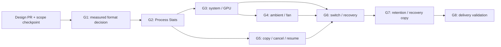

# Hardware Archive Implementation Plan

Parent: [#2052](https://github.com/shm11C3/HardwareVisualizer/issues/2052).

This is an issue breakdown for review alongside
[ADR 0021](../adr/0021-hardware-archive-migration-lifecycle.md) and the
[storage design](../architecture/hardware-archive-storage-design.md). It does
not create child issues or enable migration. G1–G8 are local draft IDs; replace
the dependency references with real issue links when the breakdown is accepted.
The documentation PR must reference, not close, #2052.

## Sequence and release boundary

The accepted sequencing in ADR 0019 remains: finish the current #1666 scope,
then refresh inventory and benchmark before selecting the format. This design
PR can precede that work. Resolve what constitutes that scope at G1; an Open
parent alone is neither evidence of completion nor a permanent prohibition on
starting. New summary/query changes must be included in the measured baseline.

| Slice | Type | Blocked by | Independently verifiable outcome |
| --- | --- | --- | --- |
| G1: Prove Process Stats and sensor format candidates | HITL | Design acceptance; current #1666 scope/inventory checkpoint | Reproducible baseline and format recommendation with exact round trips |
| G2: Record and query chunked Process Stats | AFK | G1 | Process Insight/Insight Snapshot work on tail/chunks, with paging and partial errors |
| G3: Record and query system/GPU history | AFK | G2 | Hardware/Cooling consumers preserve metric and GPU semantics |
| G4: Preserve ambient/fan timelines and rollup inputs | AFK | G3 | Paired Thermal Delta and fan history survive mixed storage |
| G5: Copy, validate, and resume a live database | AFK | G2 | Source stays usable while a mixed-format candidate is copied, cancelled, or resumed |
| G6: Select the verified database and recover interruption | AFK | G3, G4, G5 | Native optimization completes a recoverable switch; restart chooses correctly |
| G7: Maintain retention and remove verified recovery copies | AFK | G6 | Long sessions compact/delete safely and expose maintenance/cleanup outcomes |
| G8: Validate long-history delivery and authorize enablement | HITL | G1–G7 | Evidence-backed decision to enable the complete migration |

HITL means explicit maintainer review of measurement/product acceptance.
AFK means implementation can follow the accepted contract through ordinary PR
review without another product-design decision. It does not authorize automatic
merge. A failed correctness/performance gate returns to the owning decision.

Each slice includes the relevant schema/Core/App/frontend/test path, rather
than creating standalone codec, DTO, and UI layer issues. G1 is an experimental
path; G5 is a complete candidate-copy workflow that stops before activation.
G2–G7 run against isolated test/development generations until G8. No temporary
production flag, permanent dual writes, or automatic migration is implied.
Partial implementation must not expose Optimize now to normal installations.

## G1 — Prove Process Stats and sensor format candidates

**Type:** HITL. **Blocked by:** design acceptance and the #1666 scope checkpoint.

### What to build

Refresh the full database/query inventory, capture a reproducible row-based
baseline, and exercise one Process Stats path and one sensor path through
encoding, SQLite persistence, atomic finalization, queries, and exact decoding.
Compare the design's preferred batches with alternatives. Produce the measured
format decision and ratified budgets before production-format implementation.

### Acceptance criteria

- [ ] Pin source revision, schema, all table/object decisions, query consumers,
  and the #1666 scope checkpoint, including any added covariate summaries.
- [ ] Include Process Stats from the first storage/CPU/memory/query baseline;
  use 24-hour, 30-day, one-year, and ten-year datasets with documented generation.
- [ ] Both representative paths preserve typed samples, timestamps, nulls,
  multiplicity, and identity exactly; query arithmetic is tested separately.
- [ ] Compare per-family layouts, chunk time/row/byte caps, codecs, compression,
  and indexes; record each family's conversion or preservation decision.
- [ ] Ratify numerical comparison, total/per-family size, query/append latency,
  CPU, memory, migration throughput, temporary-space, and pause budgets with
  commands, hardware, repeat policy, and results. Freeze a numerical migration
  throughput floor and ten-year query budget from this baseline.
- [ ] Maintainer accepts the measured recommendation; failures revise design
  without dropping Process Stats or weakening preservation guarantees.

## G2 — Record and query chunked Process Stats

**Type:** AFK. **Blocked by:** G1.

### What to build

Implement the first complete chunk-backed Process Stats path on isolated
candidate generations: minute append, durable tail, finalization, restart, and
arbitrary-range Process Insight/Insight Snapshot results. Include bounded paging
and incomplete-result presentation at the typed App/frontend boundary.

### Acceptance criteria

- [ ] Freeze and document selected binary framing, versions, byte order, digest,
  allocation limits, dependency/license choice, and golden vectors from G1.
- [ ] Preserve all stored records and `(pid, process_name)` grouping, averages,
  maximum execution seconds, latest timestamp, and requested ordering.
- [ ] Tail/chunk snapshot reads and concurrent/retried finalization never omit
  or double-count rows, including shutdown flushes and duplicate instants.
- [ ] All groups remain accessible with bounded pages; define query snapshot
  lifetime/count, total bytes, spill limits, cancellation, expiry, and cleanup.
- [ ] Decode/header/unsupported-version failures return readable observations
  with an explicit incomplete ranking in both consumers; whole-DB failure
  remains a recovery error. No payload is deleted on read failure.
- [ ] Core/App/consumer tests, rendered paging/error cases, and format benchmarks
  pass; production legacy recording remains the selected default until G8.

## G3 — Record and query system and GPU history

**Type:** AFK. **Blocked by:** G2.

### What to build

Extend the selected storage path to system and GPU families approved by G1.
Route every dependent Hardware Insight, Insight Snapshot, and Cooling read
through Core's storage boundary, including rollup inputs. A family rejected by
measurement stays relational with documented evidence and coverage tests.

### Acceptance criteria

- [ ] Preserve nullable average/minimum/maximum values and all existing power,
  temperature, usage, and memory columns without narrowing stored values.
- [ ] Preserve name-based GPU queries, opaque/absent IDs, and already-combined
  same-name observations; no physical-device reconstruction or inventory join.
- [ ] Match endpoint-specific ranges, bucket placement, weighting, statistics,
  gaps, and point/byte limits against the row-based oracle.
- [ ] All direct raw-table readers in the refreshed inventory are routed or
  explicitly retained, including Cooling ranges, earliest/latest timestamps,
  counts, and catch-up probes; no hidden SQL consumer reads an emptied table.
- [ ] Incomplete inputs cannot silently establish baselines or successful
  rollup coverage. Partial-read UI, contract tests, and G1 budgets pass.

## G4 — Preserve ambient and fan timelines and rollup inputs

**Type:** AFK. **Blocked by:** G3.

### What to build

Complete ambient/fan storage decisions through minute recording, Cooling
queries, and source-aware rollups. Preserve the distinct timeline and daily
pairing rules and independent longer-lived summaries/baselines.

### Acceptance criteria

- [ ] Preserve source labels, nullable humidity, real zero RPM, missing rows,
  timestamp precision, and existing duplicate-record behavior.
- [ ] Verify paired-minute/source semantics across legacy/tail/chunk boundaries;
  never subtract independent CPU/ambient aggregates or blend source baselines.
- [ ] Preserve daily/fan/Thermal Delta summaries and both baselines directly,
  including rows whose original minute data no longer exists.
- [ ] Update source lists, capability/empty-history checks, catch-up probes and
  any new #1666 consumer; every direct SQL dependency is accounted for.
- [ ] Incomplete paired input yields honest coverage/errors, cannot create a
  misleading baseline, and cannot authorize deletion. Render relevant gaps.
- [ ] Exact/query tests and per-family/total budgets pass; relational exceptions
  have explicit measured decisions rather than omitted conversion work.

## G5 — Copy, validate, and resume a live database

**Type:** AFK. **Blocked by:** G2. Can proceed alongside G3/G4 using mixed families.

### What to build

Deliver the candidate-copy workflow from the optimization interaction through
Core capture, bounded conversion, incremental validation, cancellation, and
restart. Legacy reads/writes stay active. Stop at a validated candidate in the
development workflow; G6 adds selection. Use G2's process conversion and preserve
other families relationally until their converters are available.

### Acceptance criteria

- [ ] Preflight classifies every schema object, source identity, conservative
  uncompressed destination expansion, source growth, WAL/capture and reserve.
  Unknown schemas or insufficient space leave source usable.
- [ ] Source archive prefixes cannot be updated/deleted/reuse IDs during capture;
  preserved-table inserts/upserts/deletions/key changes enter transactional
  changed-key tracking, including Storage Health activity and baselines.
- [ ] Copy/reconciliation commits records, exact validation, and checkpoints
  consistently. Conditional acknowledgements cannot erase newer changes;
  fault injection covers commit-before-ack replay and concurrent writes, with
  durable source prefixes/destination batches and non-reused capture revisions.
- [ ] Validated progress is bounded-memory and restartable with matching source,
  schema, triggers and candidate. Invalid capture starts fresh, never guesses.
- [ ] Normal quit flushes and can resume; cancel invalidates the attempt, removes
  only its bookkeeping, and restores maintenance. Low space/capture failure
  cannot leave retention disabled indefinitely.
- [ ] Later, phases, validated progress, cancel/retry and available space render
  correctly; live queries and roughly minute archive visibility continue.
- [ ] Validate mutable-table coverage and foreign keys after reconciliation,
  preserve migration checksums/sequence state, and prove the verification
  ledger does not need a full-history scan during final pause.

## G6 — Select the verified database and recover interruption

**Type:** AFK. **Blocked by:** G3, G4, G5.

### What to build

Finish native optimization with a generation access owner, bounded quiescence,
final reconciliation, durable destination seal/control selection, and restart
recovery. Include all database users and preserve the old source as a recovery
copy. Keep normal-installation enablement behind G8's delivery decision.

### Acceptance criteria

- [ ] All read/write/rollup/Storage Health access leases the active generation;
  drain includes pending archive writes without deadlock or collector blockage.
- [ ] Final catch-up fits the ratified pause budget; a pre-selection timeout
  resumes source recording. No migration-long or extra-interval recording gap.
- [ ] Seal/checkpoint/file/directory durability precedes control selection;
  selected paths and identities are validated before normal startup preflight.
- [ ] Fault-inject every boundary in the design's recovery table on Windows,
  macOS and Linux, including busy handles and interrupted control commits.
- [ ] After selection, failed reopen or newer destination writes never trigger
  automatic source fallback. Missing/corrupt control is not empty-DB creation.
- [ ] Distinguish app-crash proof from OS/power-loss proof. Keep normal archive
  WAL/NORMAL policy; verify the stronger rare seal/control operations explicitly.
- [ ] Recovery exposes retry, live-only continuation preserving files, and exit;
  reset is not the only path. Native tests prove authority and monitoring cadence.

## G7 — Maintain retention and remove verified recovery copies

**Type:** AFK. **Blocked by:** G6.

### What to build

Run bounded maintenance during long sessions and expose maintenance status and
explicit recovery-copy removal in Settings. Preserve current preferences,
rollup dependencies, independent retention, and source protection on failures.

### Acceptance criteria

- [ ] Finalization continues with scheduled deletion off; deletion uses current
  preferences, not stale startup values.
- [ ] Delete only fully expired chunks after successful dependent rollups;
  never delete unreadable/unclassified or unexpired input. Preserve baseline
  protection and independent Cooling/Storage Health row retention.
- [ ] Cadence/work budgets keep up with normal ingestion and restart backlog;
  report backlog, failure and last success. Test the conditional retention bound.
- [ ] Subsequent startup verifies selected identity/seal/integrity and migration
  validation before explicit recovery-copy removal becomes available.
- [ ] Removal verifies source ID/non-selection/closed handles, survives interruption,
  and never occurs automatically. Keep the validation report.
- [ ] Show actual active DB and recovery-copy bytes separately; measure ongoing
  disk reclamation and add it only if needed, without recurring full VACUUM.
- [ ] Long-session native tests and rendered status/preferences/removal evidence
  pass within G1's resource budgets.

## G8 — Validate long-history delivery and authorize enablement

**Type:** HITL. **Blocked by:** G1–G7.

### What to build

Run the full delivery matrix on the exact candidate revision and present a
release decision. Enable optimization only when the complete Process Stats
migration and all preservation/recovery requirements have evidence.

### Acceptance criteria

- [ ] Complete the ten-year migration and 24-hour/30-day/one-year matrix with
  exact sample/table preservation, query equivalence, disk and resource reports.
- [ ] Include expired raw inputs with surviving summaries, source changes,
  high process churn, irregular timestamps, and every supported schema family.
- [ ] Demonstrate partial errors, unknown codecs, corruption, disabled deletion,
  changed preferences, failed rollups, cancellation and insufficient disk.
- [ ] Verify all recovery boundaries, first post-selection write, subsequent
  startup, and recovery-copy removal; attach separate app/OS crash evidence.
- [ ] Verify live cadence and rendered optimization/Insights behavior in both
  navigation layouts, plus actual native SQLite switching on supported OSes.
- [ ] Publish measured results and accepted family exceptions; do not call
  synthetic histories real-world evidence or call preserved backups disk savings.
- [ ] Maintainer accepts remaining measured trade-offs and enables the complete
  feature. #2052 closes only with Process Stats delivered and its full DoD met.

## Coverage and remaining decisions

| Parent requirement | Primary slices |
| --- | --- |
| Mandatory lossless Process Stats and arbitrary-range queries | G1, G2, G5, G8 |
| All other histories/metadata preserved | G1, G3, G4, G5 |
| Atomic finalization, minute visibility, crash recovery | G2, G5, G6 |
| Honest partial results and bounded queries | G2, G3, G4 |
| Whole-DB online conversion, Later/cancel/resume and safe space | G5, G6 |
| Recurring retention and recovery-copy policy | G7 |
| Long-history performance, native/rendered release evidence | G8 |

No remaining product question permits dropping stored data. The unresolved
measurement choices are the final codec/layout/limits, calibrated budgets,
per-family conversion benefit, query-snapshot resource limits, and physical
file reclamation. G1 ratifies budgets and recommendations; G2 freezes format
and query resource details; G7 resolves reclamation from evidence. G5/G6 prove
the specified capture and durability protocol rather than inventing authority
rules during implementation. Downgrade/export remains outside this plan.
