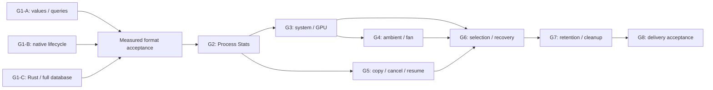

# Hardware Archive Qualification and Implementation Plan

Parent: [#2052](https://github.com/shm11C3/HardwareVisualizer/issues/2052).

[ADR 0022](../adr/0022-prioritize-native-duckdb-archive-qualification.md)
accepts native DuckDB as the next investigation priority. The
[qualification design](hardware-archive-duckdb-qualification.md) owns current
hypotheses and adoption gates. It replaces the SQLite-specific G1–G8 sequence
from the earlier design, without enabling a production migration.

## Current qualification work

The following issues are published and can begin in parallel. Each delivers a
reproducible observation-to-persistence-to-query or recovery experiment; none
is a standalone codec, DTO, or UI layer ticket.

| Track | Issue | Independently verifiable outcome |
| --- | --- | --- |
| G1-A: Exact values and query compatibility | [#2083](https://github.com/shm11C3/HardwareVisualizer/issues/2083) | Reopened Process/Ambient values remain exact; supported queries preserve membership and arithmetic |
| G1-B: Minute writes, recovery and retention | [#2084](https://github.com/shm11C3/HardwareVisualizer/issues/2084) | Concurrent queries, commits, restart and eligible deletion have measured behavior |
| G1-C: Rust integration and complete database | [#2085](https://github.com/shm11C3/HardwareVisualizer/issues/2085) | All schema/query owners and native distribution/migration requirements are qualified |

G1-C inventory, official-source research and isolated Rust setup can start
without waiting for A/B. Its full-schema conversion and final resource and
recovery conclusions depend on their selected representation and lifecycle.
A/B also need the complete inventory before claiming all-family compatibility.
The tracks converge at one explicit maintainer format-acceptance gate.

The initial inventory checkpoint is develop
`838d08da16d60ead84df3ddb1501ca19a57f24fc`, including #2070 and 23 App
migrations. Refresh it and record the current #1666 scope before format
acceptance. An Open parent alone neither proves completion nor prevents
isolated investigation. Include new summaries and queries in the baseline.

### Shared G1 acceptance

- [ ] Preserve Process Stats from the first measurement and full delivery;
  classify every other family, mutable table, summary, baseline, metadata
  object and direct query consumer. Expired source minutes cannot rebuild
  longer-lived data.
- [ ] Keep exact storage-class/value/byte/identity comparisons separate from
  query membership, grouping, weighting and numerical tolerance tests.
  Unsupported values cannot be silently omitted or cast.
- [ ] Measure representative 24-hour, 30-day, one-year and ten-year histories,
  including process churn, sparse sources, irregular timestamps and exceptions.
  Synthetic histories are not evidence of real installation distributions.
- [ ] Ratify total/per-family size, query/append latency, CPU, additional idle
  and peak memory, migration throughput, temporary-space and pause budgets.
  Freeze the ten-year query budget and migration throughput floor from evidence.
- [ ] Account for the complete indexed/constrained schema and native runtime,
  including Rust, supported packages, file compatibility and recovery tests.
  Python RSS and a memory_limit setting do not prove application overhead.
- [ ] Accept or reject the measured format/topology explicitly. Failed gates
  revise the candidate, not data-preservation or Process Stats requirements.

## Future delivery slices

G2–G8 remain local draft IDs, not published implementation-ready Issues. Rewrite
their detailed acceptance criteria after G1 selects the format and protocol.
They describe required user outcomes and dependencies, not approval of a
DuckDB schema, custom chunk layout or SQLite migration mechanism.

| Slice | Depends on | Complete outcome |
| --- | --- | --- |
| G2: Record and query Process Stats | G1 acceptance | Minute append, restart and arbitrary-range Process Insight/Insight Snapshot work on isolated native candidates |
| G3: Record and query system/GPU history | G2 | Hardware/Cooling consumers preserve metrics, nulls, GPU identities and all raw-table reads |
| G4: Preserve ambient/fan timelines and rollups | G3 | Thermal Delta pairing, source-aware timelines and independently retained summaries/baselines survive |
| G5: Copy, validate, cancel and resume | G2 | A complete candidate-copy workflow preserves source authority while immutable and mutable tables reconcile |
| G6: Select a verified generation and recover | G3, G4, G5 | Bounded quiescence and durable selection preserve correct authority across restart/failure |
| G7: Maintain retention and recovery copies | G6 | Long-running maintenance deletes only eligible data and exposes measured reclamation/cleanup |
| G8: Validate delivery and authorize enablement | G1–G7 | Full long-history/platform/native/rendered evidence supports explicit enablement |

Each future slice includes its relevant schema/Core/App/frontend/test path.
G5 can proceed alongside G3/G4 using G1's complete preservation representation;
no family may disappear while its optimized reader is unfinished. G2–G7 use
isolated test/development generations. Partial implementation must not expose
Optimize now to normal installations. Ordinary PR review does not authorize
merge, format acceptance or release enablement.

### Required contracts carried into the future Issues

**G2 — Process Stats.** Preserve `(pid, process_name)` grouping, CPU/memory
averages, counts, maximum execution seconds, latest original timestamp and
ordering for arbitrary ranges. Prove minute visibility, retries and snapshot
reads without omissions or duplicate samples. All groups must remain accessible
through bounded pages, with query lifetime/count/byte/spill/cancellation limits.
Localized failures return readable observations with an explicit incomplete
ranking in both consumers; whole-database failure remains a recovery error.
Freeze the accepted schema, file/representation versions and compatibility
vectors before implementation, without assuming a custom binary codec is needed.

**G3 — System/GPU.** Preserve nullable minimum/maximum/average independently,
all existing metrics and stored widths, name-based GPU queries, opaque/absent
IDs and already-combined same-name observations. Route every raw-table read,
including Cooling ranges, counts, earliest/latest timestamps and catch-up
probes, through the selected Core boundary. Match endpoint ranges, buckets,
statistics, gaps and limits. Incomplete data cannot establish a healthy
baseline or successful rollup coverage.

**G4 — Ambient/fan.** Preserve source labels, nullable humidity, real zero RPM,
missing rows, precision and duplicates. Keep paired-minute/source semantics;
never subtract independently aggregated CPU and ambient values. Copy daily,
hourly, fan, Thermal Delta and covariate summaries and both baselines directly.
Update capability/history checks, source lists and any added #1666 consumer.
Incomplete paired inputs cannot authorize deletion or create a misleading
baseline. Record a measured preservation decision for every family.

**G5 — Copy/cancel/resume.** Classify every object and source identity; budget
conservative destination expansion, source growth, WAL/journals, conversion
workspace and reserve. Capture immutable prefixes and mutable insert/update/
delete/key changes consistently, including Storage Health and baselines.
Prove bounded copy, exact validation, conditional acknowledgement, restart
checkpoints and replay after commit-before-ack. Unknown schemas and low space
leave the source usable. Normal quit flushes; cancellation invalidates only
its attempt, removes its bookkeeping and restores maintenance. Retention must
not remain disabled indefinitely after failure. Later, progress, cancel/retry
and space render correctly while live monitoring and minute recording continue.
SQLite source triggers may be a capture candidate; native destination schema,
transactions and checkpoints require their own qualified design. Preserve the
source migration provenance without executing SQLite DDL blindly in DuckDB.

**G6 — Selection/recovery.** Account for every reader/writer, rollup and
Storage Health operation during bounded drain and final catch-up. A preselection
timeout resumes source recording. Prove destination commit/checkpoint/close/
reopen and file/directory durability before selecting authority; two renames
are not a protocol. Selected paths and identities must be checked before normal
startup/reset logic. After selection, failed reopen or newer destination writes
never permit automatic source fallback. Missing/corrupt selection is not an
empty database. Recovery offers retry, file-preserving live-only continuation
and exit. Test app crashes separately from OS/power failure on supported OSes.
The current SQLite WAL/NORMAL policy is not a DuckDB configuration; native normal
write and rare selection durability require explicit evidence. No migration-long
or extra-interval recording gap is acceptable.

**G7 — Retention/cleanup.** Use current preferences during long sessions;
scheduled deletion controls expiry, not necessary persistence maintenance.
Delete only expired, classified records after required successful rollups;
never delete unreadable or unexpired input. Preserve independent Cooling and
Storage Health retention and baseline protection. Bound cadence/work/backlog,
report failures and prove the selected layout's conditional extra-retention
bound. Native eligible-row deletion replaces whole-chunk expiry only if that
layout is accepted. Measure logical removal, reusable space and actual file
bytes separately; any new-file compaction needs disk/cancel/recovery safeguards.
Remove a recovery copy only on explicit user action after a subsequent startup
verifies selected identity/integrity and migration validation. Recheck source
identity, nonselection and closed handles; survive interrupted removal and keep
the validation report. Display active DB and recovery-copy bytes separately.

**G8 — Delivery.** Validate the exact candidate revision across the complete
long-history matrix, all supported packages and rendered optimization/Insight
flows. Include expired raw data with surviving summaries, mutable source changes,
churn, irregular timestamps, partial errors, unsupported versions, corruption,
disabled deletion, changed preferences, failed rollups, cancellation and low
disk. Exercise every recovery boundary, first postselection write, later startup
and explicit recovery-copy removal. Publish native/app/OS evidence and accepted
tradeoffs. Do not count a retained backup as reclaimed disk. Enable only after
maintainer acceptance; close #2052 only when Process Stats and its full definition
of done are delivered.

Downgrade/export and permanent dual writes remain outside this plan. No remaining
measurement or topology decision permits dropping stored data.
