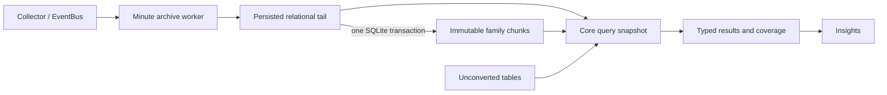
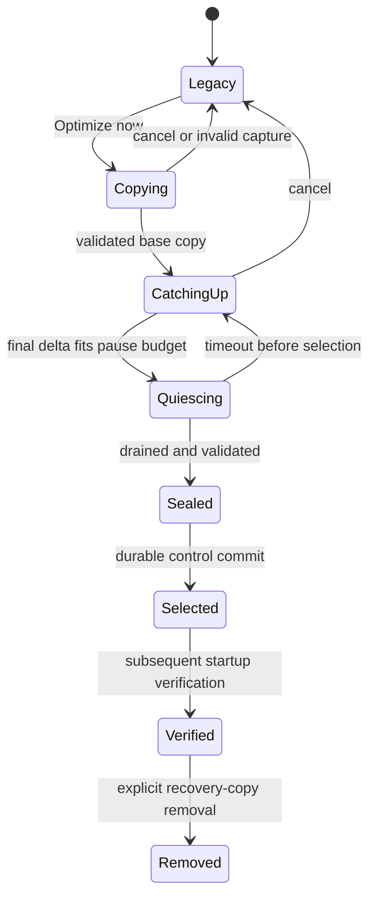

# Hardware Archive Storage Design

Status: proposed implementation design for
[#2052](https://github.com/shm11C3/HardwareVisualizer/issues/2052).

[ADR 0019](../adr/0019-lossless-chunked-hardware-archive.md) owns accepted product
guarantees. [ADR 0021](../adr/0021-hardware-archive-migration-lifecycle.md) recommends
this lifecycle. [Backend architecture](../architecture/backend.md) describes current code;
this document describes planned changes.

The claim is to reduce local archive disk usage while preserving stored history,
Process Insight answers, and monitoring during migration. It serves DP-02,
DP-04, DP-05, DP-06, DP-07, and DP-09. The
[delivery plan](../development/hardware-archive-implementation-plan.md) defines
G1–G8: draft identifiers, not published issue numbers.

## Decision inventory

| Previously open question | Recommended resolution | Remaining gate |
| --- | --- | --- |
| Layout and family scope | Relational tail plus immutable family batches; Process Stats mandatory; derived/daily tables preserved directly | G1 measures every family; G2 freezes bytes |
| Codec and chunk limits | Columnar batches, local dictionaries, lossless integer/float encoding; one-hour, row, and byte caps as first experiment | G1 compares alternatives; no claimed compression ratio |
| Query equivalence | Exact membership/discrete results; bounded floating arithmetic tolerance only | G1 freezes differential oracles for actual consumers |
| Later and ongoing writes | Legacy stays authoritative until selection; Later starts no work | G5 UI and runtime evidence |
| Capture and catch-up | Immutable archive prefixes plus transactional mutable-key reconciliation | G5 concurrent mutation and resume proof |
| Cutover and restart | Drain access leases; seal destination; commit selected generation durably | G6 fault injection on supported OSes |
| Progress and cancellation | Validated per-batch cursors; cancellation invalidates the attempt | G5 interruption tests |
| Disk and recovery-copy removal | Conservative preflight; continuous reserve checks; explicit removal after verified startup | G1 peak estimates, G6/G7 failure tests |
| Maintenance | Bounded Core worker; compaction independent of deletion preference | G7 long-session throughput and rollup ordering |
| Downgrade/export | Deferred under ADR 0019 | Separate decision, not a #2052 dependency |

## Verified baseline and ownership

Inspected `8d5ec22aa0df259b94ff562cc5f876b6e9398cab` on 2026-09-05; the App's
migration set ends at version 22. Refresh after the current #1666 scope. The
in-flight [#2070](https://github.com/shm11C3/HardwareVisualizer/pull/2070) changes
summary schema and consumers; its covariate table is not counted as present.

| Current tables | Format/copy decision | Contract to preserve |
| --- | --- | --- |
| `PROCESS_STATS` | Required chunk conversion | `id`, `(pid, process_name)`, CPU/memory, execution seconds, timestamp, multiplicity |
| `DATA_ARCHIVE` | Preferred chunk conversion | Each nullable metric/statistic independently |
| `GPU_DATA_ARCHIVE` | Preferred chunk conversion | Name, nullable opaque GPU ID, already-combined same-name records, all statistics |
| `AMBIENT_ARCHIVE` | Preferred chunk conversion | Environmental Sensor Source Label, temperature, nullable humidity, actual timestamp, absent intervals |
| `FAN_ARCHIVE` | Preferred chunk conversion | `source` from live fan `name`; real zero RPM remains a record |
| `cooling_daily_summary`, `cooling_hourly_summary` | Keep relational | Mutable keyed summaries, independent retention, baseline-protected rows |
| `cooling_fan_daily_summary`, `cooling_thermal_delta_daily_summary` | Keep relational | `(date, source)`, counts/statistics; no cross-source blending |
| `cooling_baseline`, `cooling_delta_baseline` | Keep relational | Fixed values, dates, counts, and Thermal Delta source |
| `storage_devices`, `storage_health_daily_records` | Keep relational | Device IDs, foreign keys, activity changes, same-day updates |
| `_sqlx_migrations`, `sqlite_sequence`, schema objects | Preserve applicable metadata; append real migrations | Original checksums and sequence high-water marks; no fabricated migration success |

Sources: [archive producer](../../core/src/persistence/archive.rs),
[database writers/readers](../../core/src/infrastructure/database/), and
[App migrations](../../src-tauri/src/infrastructure/database/migration.rs).
GPU namespaces remain as recorded in [ADR 0019](../adr/0019-lossless-chunked-hardware-archive.md)
and [ADR 0016](../adr/0016-gpu-attribution-on-the-performance-screen.md).
Dictionary references are local compression keys, never new device identities.
Do not relabel old ambient rows with today's selection or join recorded GPU IDs
to inventory IDs. This design introduces no identity join.

Classify every actual table, column, index, trigger, view, and relevant pragma.
An unknown object/schema fingerprint refuses optimization while keeping the
source usable; it is not permission to omit data. Extend the reviewed inventory
to support a new schema. Preserve summaries even when all their raw inputs have
expired; do not regenerate them as a copying shortcut.

| Owner | Required change |
| --- | --- |
| Core database owner | Lease access to one generation; own pools, codecs, queries, capture, migration execution, maintenance |
| Core collection | Preserve EventBus independence and sampling/ranking; database work cannot block collection |
| App | Resolve paths, supply ordered migrations, orchestrate lifecycle, expose typed progress/result DTOs |
| Frontend | Optimization interaction, paging, incomplete-history notices and gaps; no storage-format routing |

Today's `db::get_pool()` opens pools on demand against a `OnceLock` path. All
callers, including Cooling and Storage Health, need generation leases before
online cutover. Selected-generation metadata is operational Core state, not a
Tauri Store value or Application Preference. Actual preferences retain their
Rust-owned `settings.json` boundary.

## Storage and finalization

A generation's family manifest selects legacy rows or tail-plus-chunks. A
logical record must never enter both modes. The logical schema requires:

- A family manifest with storage mode, schema/codec versions, and monotonic
  record-sequence high-water marks that retention never resets.
- A relational tail with complete typed records and original IDs. New IDs
  continue above migrated IDs even for families formerly lacking `AUTOINCREMENT`.
- A chunk catalog with family/chunk ID, versions, actual timestamp min/max,
  record count, decoded-byte bound, integrity digest, and payload. Index time
  candidates by family; add source/name indexes only with measured need.

Payloads contain complete family records, including original IDs. Local
string dictionaries and null/type bitmaps preserve row boundaries. Encode the
SQLite values actually read: signed 64-bit integers, binary64 REAL values,
TEXT/BLOB bytes, nullness, and exact timestamp representation. Do not migrate
through narrower live `f32`/`i32` structs. Unexpected storage classes require a
lossless representation or a source-preserving preflight refusal, never casts.

The first experiment caps each chunk at **one hour, 4,096 records, and 4 MiB
decoded bytes**, whichever comes first. Sparse sources close on elapsed time.
Backward clock steps close the current batch; overlapping time ranges across
chunks are allowed. Never deduplicate by timestamp. An individually oversized
record stays in the converted family's relational tail with an explicit
conversion decision; the overall Process Stats gate still applies. Mark that
exception so finalization can skip it without blocking later eligible records.
It remains queryable and follows the rollup-gated row expiry below.

Compare columnar batches with per-series sensor batches and larger bounded
windows. Candidates include dictionary encoding, null bitmaps, integer/time
deltas with lossless absolute fallback on overflow, and binary64 XOR. Timestamp
encoding must reconstruct the original stored representation. Optional zstd
needs incremental disk benefit justified by measured write/decode cost. G2
pins framing, byte order, versions, digest, limits, golden vectors, and any
new dependency/license decision before production writes.

One finalizer per generation selects bounded tail IDs and encodes outside the
write transaction while holding its generation lease. In one transaction,
recheck that every exact selected ID is still present, insert the chunk, and
delete exactly those IDs. Require the affected-row count to equal the selected
count; any mismatch rolls back the entire transaction and replans from the
persisted tail. Rows are immutable and IDs are never reused within a generation,
so this conditional consumption is the idempotency boundary.

A commit error may mean the commit succeeded. Never blindly replay its cached
payload: open a new transaction and select from persisted tail state. A prior
successful commit consumed those IDs atomically with its chunk; a rolled-back
commit left them available. This also handles retention removing eligible rows
while encoding. A separate persistent retry-key table is unnecessary for this
single-database operation. Test failure after commit but before completion
acknowledgement, as well as rollback and a changed selection before commit.

Each query reads tail/chunks in one SQLite snapshot, observing before or after
finalization. Keep reads short and buffers bounded; never rewrite the entire
active BLOB each minute.

The digest covers payload and interpretation-critical metadata. Validate
bounds, lengths, counts, versions, and allocation limits. Corrupt catalog bounds
must not silently hide a chunk during candidate selection: untrusted bounds
make family coverage unknown. G2 must demonstrate that detection as well as
payload verification. Preserve unreadable payloads for recovery.

## Query contract

Use current Core queries and Cooling read owners as differential oracles;
freeze each endpoint's actual semantics, which are not uniform:

| Boundary | Contract |
| --- | --- |
| System/GPU series | Inclusive TEXT `BETWEEN` under App normalization; metric-specific `AVG`/`MAX`/`MIN`; start/end bucket placement; existing 10,000-point limit |
| Process Insight / Insight Snapshot | Inclusive range; `(pid, process_name)` groups; CPU/memory averages; `MAX(execution_sec)` and latest timestamp; CPU-descending order where requested |
| Fan/ambient series | Existing epoch-millisecond membership and bucket rules, source grouping where present, null gaps and empty-source behavior |
| Cooling inputs | Existing half-open ranges, minute pairing, source separation, load bands, coverage counts, baseline protection |
| Ambient timeline versus daily Thermal Delta | Timeline reduces both sides per minute; the daily reader joins each hardware record to ambient averaged per `(minute, source)`; preserve each weighting |

Do not unify mixed timestamp predicates in this performance change. Preserve
stored timestamps and use conservative candidate bounds. Scan candidates when
a timestamp representation cannot prove equivalent membership. Test offset
forms, fractional precision, duplicates, negative epochs, restarts, and clock
steps. Match source semantics even when a cleaner predicate looks preferable.

Decoded-sample comparison is exact by family/original ID: storage class,
integer value, binary64 bits as read, text/blob bytes, nullness, and presence.
Discrete query fields, grouping, ranges, buckets, null masks, and counts are
exact. Proposed finite derived-float tolerance, in stored units before display:
`abs(actual - reference) <= max(1e-9, 1e-12 * abs(reference))`.
Null/nonfinite classification is separate. CPU ordering can permute numerical
ties only within this bound, never omit groups or reorder unequal ranks. A
wider tolerance requires a concrete arithmetic example and review in G1.

Weight streaming aggregates by each metric's valid-record count, never by
chunk count. Decode partial chunks and chunks crossing output buckets. Metadata
accelerators need a real consumer and query-equivalence tests; retained samples
and domain-specific rollups remain authoritative.

Typed results carry complete/incomplete coverage, affected family/range, and a
user-facing reason. Bound/coalesce details while preserving the failure count;
do not log raw payloads or process names. If the affected range/subject cannot
be trusted, flag the whole queried family. Whole-DB failure uses recovery.
Charts must break lines across unreadable ranges. Process results from readable
records are explicitly partial, including the ranking. Incomplete Cooling
inputs cannot establish a baseline or certify coverage for source deletion.

Current Process Stats returns an unbounded vector. Replace it with a paged
response and update both consumers. Use bounded-memory disk-backed aggregation
and a query-result snapshot; a cursor refers to that snapshot/generation, not
a fresh offset query over changing history. Start with 500 groups per page;
all groups remain accessible, without a new top-N policy. G2 freezes snapshot
count/lifetime, temporary-byte caps, and cleanup under G1's budgets. Expired
cursors require refresh; exhausted resources produce an explicit error asking
for a retry or a narrower range, not truncated success. Charts also need a total byte cap beyond
their existing point cap. Regenerate bindings at the App boundary.

## Online migration

### Offer and capture

**Optimize now** starts a Core job. **Later** creates no candidate and keeps
legacy reads/writes. It suppresses repeated offers that session; a Settings
entry remains. Do not silently start conversion on another boot. Recording
disabled does not prevent optimizing existing history. Explain that normal
recording continues except for a short final database pause.

Acquire an exclusive migration lock in addition to App single-instance control.
Create migration/source-generation IDs, a schema fingerprint, and a destination
file in the same directory. Serialize schema changes and database reset with
migration; incompatible operations invalidate the attempt first. Another app
version must not write concurrently.

Under a short source write barrier:

1. Persist capture state and suspend deletion/update of the five raw archive
   families. Normal producers only append. Record an upper primary-key bound
   per family; timestamp is never a cursor. Prevent ID reuse/wraparound.
2. Install persistent schema-specific SQLite triggers recording a changed key
   and monotonic revision for every mutable preserved table's insert/update/
   delete. Key changes record old and new keys. This is a deduplicated set,
   not a full mutation log or an in-memory notification.
3. Durably commit capture state before releasing the barrier. Queries, archive
   appends, rollups, Storage Health refreshes, activity changes, and baseline
   establishment continue on source.

Capture revisions use a migration-wide monotonic counter, never a counter
reset when a changed-key entry is acknowledged. Each newly captured source
prefix is made durable before destination validation can rely on it. Use a
FULL-synchronous capture transaction that writes its capture watermark as the
source WAL durability barrier; a read-only transaction is insufficient. Apply
the same barrier to each mutable-table base-copy/reconciliation batch before
its destination commit. Do not infer durable source contents from an ordinary
NORMAL commit.

Copy raw archives with short keyset reads up to their bound. Compare each
encoded/decoded batch with those immutable source rows. Copy preserved tables
in bounded keyset batches; reconcile their changed keys after base copy. The
candidate is private until complete. Preserve original keys; validate foreign
keys after reconciliation, not against a partly copied table set.

For each changed key, read its revision and current row/deletion in one source
snapshot. Commit idempotent replacement/deletion and validation to destination.
Make that destination batch durable before conditionally acknowledging the
source revision; use FULL-synchronous migration-batch commits. Otherwise a
power failure could keep the acknowledgement but roll back its destination
rows. A newer revision remains pending. A crash before acknowledgement causes
harmless replay. Never assume transactions across the two WAL databases are
atomic.

Capture and copy further archive ID prefixes. Commit destination records,
validation, and progress cursor together. Track mutable verification by key
and revision. Empty changed-key sets and matching final archive bounds under
the final barrier establish convergence to one source state, rather than
claiming the online base copy was a single snapshot.

Bound capture/candidate growth and source growth while raw retention is
postponed. Do not hold a migration-long read snapshot or pin WAL indefinitely.
Capacity/capture failures cancel safely and restore maintenance; they cannot
leave deletion disabled indefinitely or produce a partially captured success.

### Validation, progress, and resume

Report preflight, copying, validating, catching up, switching, and complete,
with validated records/bytes per family and space usage. The denominator may
grow with new writes; ETA needs measured throughput. Success follows selection
commit, never merely the end of copying.

Validation covers exact decoded records, preserved-table coverage, schema and
sequences, foreign keys, SQLite integrity, and differential query cases.
Equal aggregates or hashes alone are insufficient. Keep a durable verification
ledger: immutable batches need not be reread, but every changed mutable key
must be revalidated. Run full candidate integrity checks before the barrier;
verify subsequent changes and the final seal during it. G5/G6 must prove this
ledger so the final pause does not re-scan years of history.

Cancel waits for one bounded batch, invalidates the candidate, removes only
that attempt's capture bookkeeping, and restores source maintenance. A later
attempt starts fresh. After selection, cancel is not rollback. Abandoned
candidate cleanup is retryable and never targets the selected DB.

Resolve migration control before startup schema migrations or retention.
Resume only with matching source ID/schema, capture guard/triggers, destination
version, and validated checkpoints. If capture is missing or the source changed,
invalidate the candidate and keep source usable. Normal quit checkpoints
progress and flushes observations; the explicitly started attempt may resume
on restart. A cancelled attempt never auto-resumes.

### Durable generation selection

Keep stable generation filenames and the original source in place. A small,
versioned Core control SQLite database records state, selected path/generation,
source/destination IDs, and destination seal. App resolves it before normal
preflight. Control commits, capture barriers, destination migration batches,
and sealing use `synchronous=FULL`; normal archive writes retain `NORMAL`.
Paths stay inside the app-data directory.

The database owner stops new leases, drains readers/writers, and allows the
archive worker's final pending write through the controlled drain before
fixing final bounds. The collector continues; new DB requests receive a
retryable switching state. Retain a bounded pending archive interval. Target
**5 seconds**; if drain/catch-up exceeds the budget before selection, release
the barrier and resume source recording. Never pause for bulk conversion.

Reconcile the final changes, durably checkpoint/seal both databases, close
handles, and verify destination reopen. Its seal names migration ID, versions,
and validated coverage. Flush required files and directory entries with a
platform-tested protocol. Then commit destination selection in control and
reopen it through the Core owner. This is ordered durable publication, not an
atomic transaction spanning files.

| Failure boundary | Authority and recovery |
| --- | --- |
| Capture/copy/catch-up/drain failure | Source; resume verified progress or abandon candidate |
| Sealed destination, no selection commit | Source; revalidate changes if source resumed before retry |
| Interrupted control commit | Recover SQLite control state; obey its source/destination selection |
| Destination selected, reopen fails | Destination; preserve both files and show recovery; no automatic fallback |
| New destination writes exist | Destination; source is an older recovery copy |
| Control corrupt/missing beside generation artifacts | Recovery error; never initialize empty data or silently choose old source |
| Recovery-copy removal interrupted | Destination; retry removal using recorded source identity only |

Legacy-path initialization is allowed only when no control/generation artifacts
exist. Unsupported control/format versions are compatibility errors. Selection
precedes App's current preflight. Migration recovery must offer retry, live-only
continuation with all history files preserved, and exit; reset is not the only
escape. Source fallback after destination writes is not a recovery shortcut.

WAL is persistent database state. Do not copy the main file alone while writers
are active or unlink a live WAL. Test app termination separately from OS/power
failure: `NORMAL` does not establish a hard one-minute power-loss bound. The
seal/control ordering must never replace recoverable old history with an
incomplete destination.

### Disk budget and recovery copy

Additional free-space estimate:

`destination_uncompressed_bound + indexes + source_growth + WAL_and_capture_bound + workspace + reserve`

Include original source DB/WAL in the displayed total peak; it is already
occupied and cannot be counted as soon-to-be-free capacity. Bound destination
expansion from inventory/encoding without assuming compression. If no safe
bound is available, refuse optimization. Initial reserve:
`max(1 GiB, 20% of estimated additional work)`, to be validated in G1.

Recheck between batches; stop before consuming reserve. Disk exhaustion,
unexpected WAL growth, or catch-up persistently slower than ingestion cancels
conversion with a retry explanation. Prefer source recording over optional
candidate/query work; do not fill disk just to preserve resumability.

Keep the source after selection. A subsequent successful startup checks selected
identity/seal, integrity, and recorded validation before offering explicit
removal with size/date. Verify the copy is closed, matches its recorded ID,
and is not selected. Keep the validation report. No timer deletes it. Display
active-database savings separately from recovery-copy disk usage.

## Maintenance and retention

One cancellable Core worker per generation checks stale-tail finalization each
minute and rollup-gated retention every 15 minutes. Initial pass budget: 32
chunks or 100 ms before yielding, whichever comes first; one bounded chunk may
finish before yielding. Prioritize archive writes and visible queries. G1/G7
measure throughput including decode/transaction time and post-restart backlog.

Compaction runs independently of `scheduledDataDeletion`. Re-read preferences
when deleting. Delete a chunk only if its latest actual sample is strictly
older than its cutoff and every dependent rollup has covered it successfully.
Unreadable/unclassified input holds deletion. Keep row-based retention for
unconverted families, independent Cooling/Storage Health policies, and current
baseline protections. Compaction preserves source samples and therefore need
not wait for rollups; deletion must wait.

Apply bounded row-based expiry to the tail of converted families too, including
oversized records permanently excluded from chunks. Each row must be strictly
older than its own timestamp cutoff and have successful dependent-rollup
coverage before deletion; invalid/unreadable timestamps hold that row and report
an error. The same deletion preference and baseline protections apply. Under
healthy maintenance, these exceptions expire within one retention cycle after
eligibility; they neither wait forever for finalization nor block other work.
G7 tests repeated oversized rows, mixed eligible/unexpired rows, disabled
deletion, and rollup failure without indefinite retention or premature removal.

Report last success, backlog, and failures with bounded retry backoff. With
one-hour chunks and healthy deletion completed each 15-minute cycle, additional
raw retention is at most 75 minutes. This conditional bound excludes migration,
disabled deletion, failed rollups, and backlog; report those states. Physical
SQLite file reclamation belongs in G7 only when measurements require it for
actual disk savings; never run full `VACUUM` on each pass.

## Measurement gate

These are **proposed engineering budgets**, not results of this documentation
PR. G1 must ratify or revise them with evidence before selecting a format.
Do not loosen product guarantees or present estimates as measured savings.

| Dimension | Initial acceptance criterion |
| --- | --- |
| Correctness | Zero sample/schema/identity loss; exact discrete query contracts and the separate floating tolerance |
| Active DB disk | At least 50% lower Process Stats footprint including indexes; at least 30% lower total representative DB for 30-day/1-year workloads; report preserved families separately |
| Small histories | Explain any total DB growth over 5% on 24-hour data, including fixed metadata cost |
| Queries | Warm p95 no worse than `max(1.2 * baseline, baseline + 20 ms)` for existing ranges; ratify separate ten-year paged/aggregate latency budgets |
| Append/visibility | No missed archive interval; p99 append transaction below 100 ms with concurrent workload |
| Steady background CPU | Additional maintenance averages at most 1% of one logical CPU over 30 minutes; report reference hardware and absolute CPU |
| Working memory | At most 64 MiB extra steady-state; 256 MiB extra for migration/query aggregation, independent of history length |
| Migration | Catch-up faster than ingestion, bounded buffers, measured disk peak below preflight allowance; ten-year migration finishes without reset/shortened retention |
| Cutover | Target 5 seconds; no extra archive interval lost under supported workload and no loss of validated old history |

Measure 24 hours, 30 days, one year, and ten years. Cover realistic process
ranking and high PID/name churn, same-name GPUs, ambient changes, many fans,
null/sparse values, duplicate instants, and shutdown flushes. Use production-shaped IDs without consulting prohibited sensor implementations. Label synthetic
history as synthetic; never commit local process/device data.

Record hardware/OS/filesystem, SQLite/Rust versions, commit/seed, repetitions,
cold/warm policy, p50/p95/p99, DB/index/WAL/temp bytes, CPU, and peak RSS.
Compare equal samples and equivalent queries. Include source growth, capture,
validation, recovery-copy cost, and paging, not just codec microbenchmarks.

The report selects each family's layout, limits, codec, compression, and indexes
or explains retaining relational rows. If Process Stats or total benefit fails,
return to design review; a sensor-only result does not complete #2052.

## Required evidence before enabling migration

- Exact round trips and golden bytes: types, nulls, duplicates, source labels,
  large integers, irregular timestamp forms, and oversized records.
- Mixed legacy/tail/chunk reads and concurrent finalization without omissions
  or duplicate counts; every Insights and Cooling consumer covered.
- Corrupt payload/catalog, missing chunks, unsupported versions, whole-DB
  failure: readable remainder plus error, no invented zeros or baselines.
- Concurrent summary upserts, Storage Health updates/activity changes, key
  changes/deletions, cancel/resume; summaries whose raw inputs have expired.
- Fault injection at seal, selection, reopen, first new write, and copy removal
  on Windows/macOS/Linux, including WAL/busy handles; separate power-failure tests.
- Ten-year migration, preflight/mid-copy disk exhaustion, recurring retention,
  disabled deletion, preference changes, and rollup failures/backlog.
- Rendered Later/progress/cancel/retry, partial Process Insight, gaps, and
  recovery in both navigation layouts; native DB-switch/cadence evidence.

## SQLite references

- [WAL concurrency](https://sqlite.org/wal.html#concurrency)
- [WAL files are database state](https://sqlite.org/wal.html#the_wal_file)
- [Durability policies](https://sqlite.org/pragma.html#pragma_synchronous)
- [Trigger semantics](https://sqlite.org/lang_createtrigger.html)
- [Row IDs and reuse](https://sqlite.org/autoinc.html)
